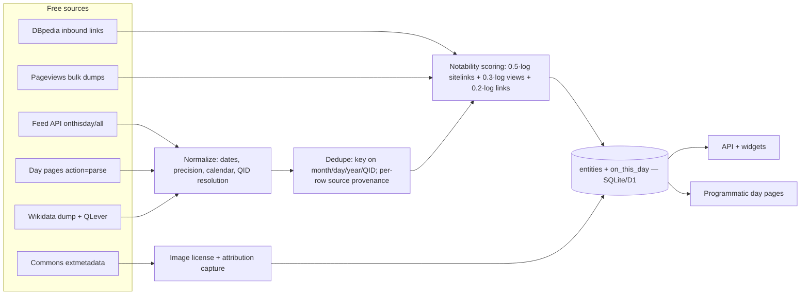

## 6. Database Architecture Blueprint

A production-grade on-this-day database costs nothing in data licensing and about one focused week of engineering — provided three constraints are designed in from day one: the public Wikidata Query Service (WDQS) cannot be your query layer, every row carries source provenance for multi-source dedupe, and notability is precomputed offline, never ranked at read time. The pipeline: ingestion (6.1), tested SPARQL recipes (6.2), notability scoring (6.3), schema and taxonomy (6.4), images (6.5).

### 6.1 Ingestion pipeline

#### 6.1.1 Crawl plan

The crawl is deliberately boring: five free sources, distinct roles, distinct cadences. The bulk entry point is the Wikimedia Feed API: `onthisday/all/{MM}/{DD}` collapses an entire day (selected, events, births, deaths, holidays) into one JSON document, so a full language costs 366 requests and all 14 supported Wikipedias — 5,124 calls, roughly 1–2 GB — finish in about an hour on a free personal token (5,000 req/h; anonymous 500 req/h) [^F-12^][^F-8^]. Two decisions matter more than the fetch. First, cadence: day pages are living documents (a death appears within hours of an edit), so re-fetch each date weekly, "today/tomorrow" daily, keeping raw per-day JSON as a replayable snapshot [^F-3^]. Second, the recency gap: the feed's `events` list silently excludes the last ~2 years (on July 19 the article lists 2024/2025 events; the feed starts at 2018) [^F-3^]. Close it by parsing day-page wikitext via `action=parse`, with machine-regular, byte-offset-addressable sections [^21^][^F-10^].

Wikidata plays the opposite role: precompute source, not live API. The naive month/day births query scans ~11M `wdt:P569` statements and times out on public WDQS (60 s cap, no month/day index — HTTP 502 in tests) [^1^][^4^]; the identical query returns in 0.05–1.3 s on the QLever mirror [^2^]. The production answer: one pass over the Wikidata JSON dump (~100 GB) yields all five date properties plus sitelink counts — the entire DB offline, zero rate limits [^22^].

| Source | Ingestion method | Refresh cadence |
|---|---|---|
| Wikimedia Feed API (`/onthisday/all`) | 366 REST calls/language, serial ≤5 req/s, contact-bearing User-Agent [^F-12^][^F-13^] | Full crawl once; per-date weekly; today/tomorrow daily [^F-3^] |
| Wikipedia day pages (`action=parse`/`action=raw`) | Section wikitext parse; fills last-2-years events gap; only path to 300+ non-feed languages [^F-10^][^21^] | Weekly; recent dates daily |
| Wikidata (QLever → JSON dump) | SPARQL recipes (§6.2) for prototyping; dump precompute for production [^2^][^22^] | Dump monthly; QLever ad hoc |
| DBpedia SPARQL | Inbound-link counts (`dbo:wikiPageWikiLink`) as second notability signal [^18^] | Quarterly (releases lag ~monthly) |
| Pageviews bulk dumps | Trailing-90-day averages per entity [^15^] | Weekly |
| Commons API (`extmetadata`) | License + artist per P18 image [^29^] | At ingest |

The outlier is Wikidata: the only source that must be treated as a bulk dataset rather than an API, because this product's defining query — "everything dated month M, day D" — is exactly what public SPARQL endpoints cannot serve [^4^]. Hence two tiers: SPARQL on QLever (never WDQS) for development; dump-derived local tables for anything customer-facing. A sixth, optional source — vizgr (192,463 events; endpoint defunct, data frozen ~2013) [^24^][^26^] — is pre-2013 backfill only; skip at launch. Initial build: ~5,100 feed calls plus one dump pass — laptop-feasible; recurring cost: the weekly re-crawl (~366 × 14 calls), one scheduled job. All six streams converge on a single normalize → dedupe → score pipeline:



### 6.2 Wikidata SPARQL recipes (tested)

#### 6.2.1 Four patterns cover every content type

Every content type the Feed API omits — and the global ranking the feed never provides — comes from four tested query patterns (July 19 as the test date). Births use `wdt:P569` with `MONTH()`/`DAY()` filters, ranked by `wikibase:sitelinks`, the built-in notability proxy [^2^]:

```sparql
PREFIX wd: <http://www.wikidata.org/entity/>
PREFIX wdt: <http://www.wikidata.org/prop/direct/>
PREFIX wikibase: <http://wikiba.se/ontology#>
PREFIX rdfs: <http://www.w3.org/2000/01/rdf-schema#>
SELECT ?person ?name ?dob ?sitelinks WHERE {
  ?person wdt:P569 ?dob .
  ?person wikibase:sitelinks ?sitelinks .
  ?person rdfs:label ?name . FILTER(LANG(?name)="en")
  FILTER(MONTH(?dob)=7 && DAY(?dob)=19)
}
ORDER BY DESC(?sitelinks)
LIMIT 10
```

(QLever needs explicit prefixes; `rdfs:label` replaces the Blazegraph label service [^2^].) July 19 returns Mayakovsky (124 sitelinks), Degas (113), Brian May (90) [^5^]; swapping in `wdt:P570` yields deaths — Syngman Rhee (88), Rutger Hauer (69), Aung San (63) [^6^]. Rule of thumb: ≥50 sitelinks ≈ headline, 20–50 mid-tier, <10 obscure.

Events use `wdt:P585` and need two fixes. Calendar-day items pollute results — `Q12966099 "July 19, 2010"` is a Wikinews archive page, not an event — so exclude them [^7^]:

```sparql
FILTER NOT EXISTS { ?event wdt:P31/wdt:P279* wd:Q573 }   -- drop "day" items
```

And truthy `wdt:P585` values drop the calendar model: the Battle of the Golden Spurs (11 July 1302 Gregorian) surfaces as 1302-07-19 from a stored Julian date [^7^]. For pre-1582 events, query the full statement node (`p:P585/psv:P585` + `wikibase:timeCalendarModel`) and normalize yourself; consumer products can ignore drift pre-1900.

Weddings are the differentiator — no feed source has them. Marriage dates live on the statement, not the item, via `p:P26` / `ps:P26` / qualifier `pq:P580`:

```sparql
PREFIX p: <http://www.wikidata.org/prop/>
PREFIX ps: <http://www.wikidata.org/prop/statement/>
PREFIX pq: <http://www.wikidata.org/prop/qualifier/>
SELECT ?person ?name ?spouse ?spouseName ?wedding ?sitelinks WHERE {
  ?person p:P26 ?stmt .
  ?stmt ps:P26 ?spouse .
  ?stmt pq:P580 ?wedding .
  ?person wikibase:sitelinks ?sitelinks .
  ?person rdfs:label ?name . FILTER(LANG(?name)="en")
  ?spouse rdfs:label ?spouseName . FILTER(LANG(?spouseName)="en")
  FILTER(MONTH(?wedding)=7 && DAY(?wedding)=19)
}
ORDER BY DESC(?sitelinks)
LIMIT 10
```

Wikidata holds 414,149 spouse statements with a start-time qualifier [^9^], and ranking delivers: July 19 surfaces Enrico & Laura Fermi, 1928 (169) and Frank Sinatra & Mia Farrow, 1966 (135) [^8^]. Every marriage appears twice (once per spouse), so dedupe on `(spouse pair, wedding date)` and rank by the *maximum* of both partners' sitelinks — the famous spouse is often the other one.

Holidays via `wdt:P837` ("day in year for periodic event") are mechanically trivial — 8 ms even on stock WDQS — but sparse: 6,950 statements total, ~19 per day before label filtering [^10^][^13^]. Seed from day-page "Holidays and observances" sections and the feed's `holidays` bucket; P837 stays a structured cross-check. Movable feasts (Easter, "4th Thursday of November") have no fixed month/day in Wikidata — compute per year with a holiday library and store per-year rows.

### 6.3 Notability ranking

#### 6.3.1 Composite score

Ranking turns ~440 raw items per day (July 19: 20 selected, 60 events, 228 births, 119 deaths, 11 holidays) into a headline list [^F-5^][^F-9^]. Three free signals, combined on log scales — all are heavy-tailed:

`notability = 0.5·log1p(sitelinks) + 0.3·log1p(avg_daily_views) + 0.2·log1p(inbound_links)`

1. **Sitelinks** — primary, free, precomputable from the dump (thresholds per §6.2).
2. **Pageviews** — recency-aware: Brian May averaged 2.9k–5.1k views/day in July 2025 but spiked to 8,183 on July 19, his birthday [^14^]. The "birthday bump" validates the entity↔day mapping and previews the demand pulses later chapters monetize. Use trailing-90-day averages; above ~10k articles switch to bulk pageview dumps [^15^].
3. **DBpedia inbound links** (`dbo:wikiPageWikiLink`) — a decorrelated cross-check: same top names, different order (Brian May 1,117 links vs 90 sitelinks) [^18^].

Add a fourth, human signal: membership in the feed's editor-curated `selected` list (~20/day) as a binary vote [^16^]. Compute the composite offline per entity — read-time queries never re-rank.

### 6.4 Schema and taxonomy

#### 6.4.1 One fact table, one entity dimension

The load-bearing schema decision: one denormalized fact table keyed `(month, day)` with a type discriminator, so the hot read — "everything for July 19, ranked" — is a single index scan. Core DDL (Postgres-flavored; on Cloudflare D1/SQLite replace `BIGSERIAL` with `INTEGER PRIMARY KEY AUTOINCREMENT`):

```sql
CREATE TABLE entities (
  entity_id      TEXT PRIMARY KEY,     -- 'Q15873'; synthetic ids for non-WD rows
  label          TEXT NOT NULL,
  description    TEXT,
  entity_type    TEXT,                 -- person | event | holiday | couple | place | work | org
  sitelinks      INT,
  avg_daily_views INT,
  inbound_links  INT,
  notability_score REAL,               -- composite, §6.3
  image_url      TEXT, image_license TEXT, image_artist TEXT, image_license_url TEXT,
  enwiki_title   TEXT
);

CREATE TABLE on_this_day (
  id             BIGSERIAL PRIMARY KEY,
  month          SMALLINT NOT NULL,
  day            SMALLINT NOT NULL,
  year           INT,                  -- NULL for recurring holidays
  year_precision TEXT,                 -- day | month | year (from wikibase:timePrecision)
  calendar       TEXT DEFAULT 'gregorian',
  type           TEXT NOT NULL,        -- event | birth | death | holiday | wedding | anniversary
  category       TEXT,                 -- taxonomy below
  text           TEXT NOT NULL,        -- display sentence
  entity_id      TEXT REFERENCES entities,
  entity2_id     TEXT REFERENCES entities,   -- second spouse for weddings
  notability_score REAL,               -- denormalized for read-time sort
  image_url      TEXT,                 -- denormalized for fast reads
  source         TEXT NOT NULL,        -- wikidata | dbpedia | daypage | feedapi | vizgr
  source_url     TEXT,                 -- provenance
  last_seen_dump DATE,
  UNIQUE (month, day, year, type, entity_id, source)   -- dedupe guard
);
CREATE INDEX idx_otd_day ON on_this_day (month, day, type, notability_score DESC);
```

Two design notes carry the weight. Denormalizing `notability_score`/`image_url` onto the fact row makes the day read one index range scan; `entities` still serves detail pages and score recomputation. And per-row `source` + `source_url` keeps multi-source dedupe tractable — the same battle appears in Wikidata, the day page, and the feed with different text. Key on `(month, day, year, QID)`, keep all source rows, elect one display row: day-page prose for events, generated text for births/deaths/weddings (`"1834 – Edgar Degas, French painter, born"`). Guardrail: verbatim source text is a CC BY-SA copy — attribute per screen, or store your own short factual records [^F-15^]. Categories map from Wikidata `P31`/`P279*` ancestors plus day-page link context:

| Type | Wikidata extraction pattern | Category values |
|---|---|---|
| event | P585 + occurrence filter (§6.2) | battle_war, disaster, crime_trial, politics_election, science_space, sports, arts_release, aviation, culture_society, other_event |
| birth / death | P569 / P570 + P106 occupation tree | arts, sports, politics, science, military, religion, business, other_person |
| holiday | P837 + day-page seed | public_holiday, religious_observance, international_observance (UN), national_day, awareness_day, movable_feast (computed per year), saint_feast_day |
| wedding | p:P26 / pq:P580 (§6.2) | wedding |
| anniversary | P571 inception / P577 publication / P1619 | founding_anniversary, launch_anniversary, coronation_accession |

This taxonomy does commercial work, not just tidiness. The `anniversary` type generalizes weddings to any entity with an inception, publication, or launch date matching the month/day — "Company X founded on this day in 1905" — and no feed source provides it: pure differentiation, backed by 414,149 dated marriages alone [^9^]. `movable_feast` is the only computed (not extracted) category — one more reason `year` stays nullable. Keep the `other_*` buckets honest; misclassified rows degrade faceted pages more than generic ones. Most importantly, the `type × category` grid is exactly the template space — `/july-19/battles`, `/july-19/births/musicians` — that chapter 7 turns into thousands of programmatic URLs.

### 6.5 Images pipeline

#### 6.5.1 License-safe fetch

Images are a licensing problem, not a fetching problem — the pipeline is three tested steps. Get the filename from `P18` (a light query, fine on stock WDQS) [^28^]; `Special:FilePath/<filename>?width=300` 302-redirects to the `upload.wikimedia.org` thumbnail; then the Commons API's `extmetadata` returns license and attribution — tested on Brian May's image: `LicenseShortName: "CC BY 2.0"`, `Artist: "Raph_PH"`, `AttributionRequired: "true"` [^29^]. Store `license_short_name`, `artist`, `license_url`, `attribution_required` per image and render author + license link with the thumbnail (CC BY / CC BY-SA); public domain needs none.

Two traps. First, some feed thumbnails are fair-use enwiki images — identifiable by the `/wikipedia/en/` path prefix — and not redistributable; never hotlink them [^F-5^][^F-16^]. P18/Commons never returns them, one more reason persons resolve through P18. Second, many event items have no P18 — fall back to feed thumbnails or `prop=pageimages` on the linked article. The database is now complete — and its category grid is the URL-template inventory the programmatic SEO engine in chapter 7 builds on.

#### Chapter References

*Citation convention: unprefixed `[^N^]` markers cite the Dim05 report (Wikidata/DBpedia); `[^F-N^]` markers cite the Dim04 report (Wikimedia Feed API), preserving that file's original index N.*

[^1^]: Wikidata Query Service endpoint — https://query.wikidata.org/sparql
[^2^]: QLever public Wikidata endpoint — https://qlever.dev/api/wikidata (UI: https://qlever.dev/wikidata). All heavy queries executed here.
[^4^]: WDQS 60 s timeout & fair-use limits — https://www.mediawiki.org/wiki/Wikidata_Query_Service/User_Manual ; Pham et al., "Embracing Timeouts on Public SPARQL Endpoints" (CEUR Vol-4085, 2025) — https://ceur-ws.org/Vol-4085/paper70.pdf
[^5^]: Executed births query (QLever, query-time-ms 1333) — https://qlever.dev/api/wikidata
[^6^]: Executed deaths query (QLever, query-time-ms 982) — https://qlever.dev/api/wikidata
[^7^]: Executed events query (QLever, query-time-ms 1012) — https://qlever.dev/api/wikidata
[^8^]: Executed weddings query (QLever, query-time-ms 960) — https://qlever.dev/api/wikidata
[^9^]: Executed count of P26 statements with pq:P580 = 414,149 (QLever, 54 ms) — https://qlever.dev/api/wikidata
[^10^]: Property P837 "day in year for periodic event" — https://www.wikidata.org/wiki/Property:P837
[^13^]: Executed count of all P837 statements = 6,950 (QLever) — https://qlever.dev/api/wikidata
[^14^]: Pageviews API, tested — https://wikimedia.org/api/rest_v1/metrics/pageviews/per-article/en.wikipedia/all-access/all-agents/Brian_May/daily/20250701/20250731 ; docs: https://wikitech.wikimedia.org/wiki/Analytics/AQS/Pageviews
[^15^]: Pageview bulk dumps — https://dumps.wikimedia.org/other/pageviews/
[^16^]: Wikimedia Feed API on-this-day, tested — https://api.wikimedia.org/feed/v1/wikipedia/en/onthisday/all/07/19 ; docs: https://api.wikimedia.org/wiki/Feed_API
[^18^]: Executed DBpedia births-ranked-by-inbound-links query — https://dbpedia.org/sparql
[^21^]: Executed day-page section parse — https://en.wikipedia.org/w/api.php?action=parse&page=July_19&prop=sections&format=json
[^22^]: Wikidata entity dumps — https://dumps.wikimedia.org/wikidatawiki/entities/
[^24^]: vizgr project page (dataset stats: 192,463 events) — https://www.vizgr.org/historical-events/
[^26^]: Verified: vizgr/GESIS SPARQL endpoint defunct, redirects to — https://data.gesis.org/cvbrowser/en/historicalevents/
[^28^]: Executed P18 lookup on official WDQS (wd:Q15873 → Special:FilePath) — https://query.wikidata.org/sparql
[^29^]: Executed Commons API extmetadata (CC BY 2.0, artist Raph_PH) — https://commons.wikimedia.org/w/api.php?action=query&titles=File:TaylorHawkTributeWemb030922%20(208%20copped).jpg&prop=imageinfo&iiprop=extmetadata%7Curl&iiurlwidth=300&format=json
[^F-3^]: rest_v1 mirror events feed, live-tested (sorted year-descending, starts 2018) — https://en.wikipedia.org/api/rest_v1/feed/onthisday/events/07/19
[^F-5^]: Feed API selected list, live-tested (20 items; includes fair-use `/wikipedia/en/` thumbnails) — https://api.wikimedia.org/feed/v1/wikipedia/en/onthisday/selected/07/19
[^F-8^]: Feed availability matrix (14 on_this_day languages) — https://en.wikipedia.org/api/rest_v1/feed/availability
[^F-9^]: Day-article wikitext measured via — https://en.wikipedia.org/w/index.php?title=July_19&action=raw&section=N
[^F-10^]: Day-page sections with byte offsets — https://en.wikipedia.org/w/api.php?action=parse&page=January_1&prop=sections&format=json
[^F-12^]: Official "Rate limits" page (Nov 2024) as quoted at — https://stackoverflow.com/questions/13608589/limits-of-the-wikipedia-api (500 req/h anonymous; 5,000 req/h token)
[^F-13^]: WMF User-Agent policy & enforcement — https://meta.wikimedia.org/wiki/User-Agent_policy ; https://wikitech.wikimedia.org/wiki/Robot_policy
[^F-15^]: Reusing Wikipedia content (CC BY-SA attribution) — https://en.wikipedia.org/wiki/Wikipedia:Reusing_Wikipedia_content ; WMF Terms of Use — https://foundation.wikimedia.org/wiki/Policy:Terms_of_Use
[^F-16^]: Wikimedia Enterprise (license metadata) — https://enterprise.wikimedia.com/ ; Commons license metadata pattern: `action=query&prop=imageinfo&iiprop=extmetadata`
