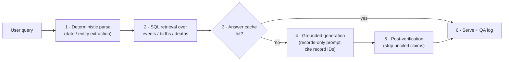

## 8. AI Premium Product Design

### 8.1 Positioning: sell verification, not chat

The premium layer must sell verified answers, not AI chat. General chatbots already answer "what happened on July 19" for free — and they answer it badly in exactly the way this product can exploit. GPT-4o scores below 40% on OpenAI's own SimpleQA benchmark of 4,326 short factual questions; reported hallucination rates on SimpleQA-class questions reach ~51% for o3 and ~79% for o4-mini; and only ~14% of ChatGPT-generated citations point to real sources.[^14^][^15^] Historical recall is the worst case: accuracy holds for major events but drops sharply for exact dates, precise quotes, and lesser-known figures.[^16^] Retrieval grounding is the documented fix — a peer-reviewed ServiceNow study (NAACL 2024) cut hallucinated entities from 13.7–16.0% to 1.7–7.2% by adding retrieval to the generation loop.[^17^] The positioning line writes itself: **"ChatGPT guesses dates. We look them up."**

Four precedent patterns define the monetization shape; none requires inventing a category:

1. **Freemium answers with daily caps.** Perplexity gives ~5 Pro searches/day free and charges $20/mo, converting an estimated ~1M paying subscribers.[^1^][^2^][^34^]
2. **Grounded-only trust products.** Britannica's ASK answers exclusively from vetted content with "no open-web results"; Scopus AI sells GenAI summaries grounded solely in Scopus's curated corpus as a paid add-on.[^4^][^10^]
3. **One-time-purchase AI artifacts.** MyHeritage turned 82 million viral free uses of a single AI feature into paid per-artifact purchases.[^7^][^6^]
4. **Niche corpus subscriptions.** Consensus sustains $10–12/mo selling answers grounded in one corpus against free general AI.[^36^]

Our competitive scans found no AI Q&A product at history.com, timeanddate, or onthisday.com (moderate-high confidence; multiple targeted searches, zero hits) — the incumbents still monetize with ads. The "verified answers over a curated date database" slot is unoccupied. The strategic decision is to claim it before an adjacent brand does, and to lead every surface with grounding and citations rather than generation.

### 8.2 Ranked premium features

Five candidates survive screening. Table 1 ranks them by impact per unit of effort; prices are set against observed analogs, not guesses.

**Table 1 — Premium feature candidates, ranked by impact/effort**

| Rank | Feature | What it is | Price | Effort | Why it wins |
|---|---|---|---|---|---|
| 1 | **Birthday AI report + printable PDF** | "The world on the day you were born": 400–800-word cited narrative + poster PDF for any date | $4.99 one-off (5 for $19.99); free teaser | Low–Med | Gift-market "year you were born" posters already sell ~$20 as digital downloads[^31^][^32^]; MyHeritage proved free-taste → paid-artifact conversion at 82M-use scale[^7^]; Ancestry's rival narratives carry no citations — the exact gap a DB-grounded report fills[^8^] |
| 2 | **Cited AI chat (subscription anchor)** | "Ask" box on every date/person page; inline record citations, follow-ups, history | $6/mo or $49/yr; 3 free answers/day | Med | Mirrors Perplexity's capped-taste model[^1^]; priced as a niche tool per Consensus's $10–12/mo, below the $20 general-AI anchor[^36^][^2^] |
| 3 | **NL → filter chat** | "Wars that started in July" → tool-calling over SQL → mini-table + summary | Included in Plus | Med | No general chatbot can do this reliably — it requires the corpus, not parametric memory; high demo value |
| 4 | **Embeddable AI widget (B2B2C)** | "On This Day AI" card + ask box for other sites, distributed via the widgetly marketplace | Free with attribution; $19/mo white-label | Med–High | Chatbase charges $199/mo just to remove branding — tenfold undercut headroom[^27^]; attribution-for-data is Calendarific's proven growth mechanic[^28^] |
| 5 | **Developer API tier** | REST: /on-this-day, /person, /ask, with keys and quotas | $9 / $29 / $99/mo + enterprise | Low–Med | Date/holiday APIs clear $10–12/mo entry and $300–4,000/yr tiers with no AI endpoint at all[^28^][^29^][^30^]; Perplexity's Search API at $5/1K requests validates usage pricing[^35^] |

The ranking is deliberate. Rank 1 is the only feature that monetizes the site's highest-intent traffic (birthday and gift searches) on first contact, at a price point validated by an existing gift market. Rank 2 is the literal mission — paid AI answers — but chat alone competes with free chatbots, so it ships bundled with artifacts and filters rather than as the whole premium story; Ancestry's criticized, uncited AI narratives show what happens when generation ships without grounding.[^8^] Ranks 4–5 are strategic rather than immediate: they convert the founder's existing widget-marketplace distribution into a backlink-and-acquisition engine and turn the curated database into a product no competitor offers. Note the pricing asymmetry on the B2B rows: at >90% gross margin (§8.4), undercutting Chatbase and Calendarific costs almost nothing and buys distribution. Effort estimates assume the shared RAG core in §8.3 exists; features 1–2 need no infrastructure beyond it.

### 8.3 RAG architecture

The architecture's first principle: the model never states a date it did not retrieve. The pipeline is a six-stage, retrieval-only RAG (retrieval-augmented generation — generation constrained to documents fetched at query time) loop:

Three design decisions do the trust work. First, **deterministic parsing**: a regex/dateparser plus entity-linking layer resolves "July 19" and "1985" before retrieval, so the LLM never parses dates probabilistically — this kills the dominant error class at the source. Second, **structured retrieval primary**: the corpus is relational (date, type, entity, tags, era), so SQL filters plus full-text search are exact and cheap; embeddings are a secondary path for fuzzy entity queries only ("the Apollo guy born in August"). Third, **a grounding contract**: the generator is instructed to use only the supplied records and cite each claim with a record ID, and a post-verification pass strips any claim whose (entity, date) pair is not in the retrieved set — the same "chain of trust" Elsevier built when grounding ChatGPT in Scopus's citation knowledge graph.[^12^] When retrieval is thin, the system refuses rather than freelances ("I can only answer from our verified database") — Britannica's vetted-corpus-only stance, which converts a limitation into a trust feature.[^4^] Small models (Flash-Lite/mini class) generate by default; grounding lets a small retriever-plus-model match an ungrounded model five times its size.[^17^]

### 8.4 Unit economics

The cost structure makes this a margin business, not a compute business. A typical cited answer (~1,800 input tokens — system prompt, ~30 retrieved rows, query — plus ~350 output tokens) costs **$0.00032 on Gemini 2.5 Flash-Lite** ($0.10/M input, $0.40/M output) and **$0.00142 on GPT-5-mini** ($0.40/$2.00); flagship models at ~$0.02 per answer are unnecessary and should be routed around.[^20^][^21^][^22^] Because on-this-day demand is deterministic per date, canonical artifacts for all 366 days (~1,100 generations) can be pre-built for **$0.35–1.60 one-time** and refreshed for under $5/yr — after which the highest-volume query class is served at zero marginal LLM cost. Three cache layers compound the advantage: an answer cache keyed on normalized intent and parameters (>90% hit rate on canonical queries), provider prompt-caching that bills repeated input prefixes at ~10% of standard rates,[^22^][^23^] and semantic caching for chat paraphrases (−30–50%).[^24^] Combined reduction versus naive per-query generation: **90–99%**.

**Table 2 — Unit economics by product tier**

| Product | Price | LLM cost / unit | Payment fee* | Cache strategy | Gross margin |
|---|---|---|---|---|---|
| Birthday report | $4.99 | < $0.001 (Flash-Lite)[^20^] | ~$0.44 | Pre-generated narrative base + per-date PDF cache | ~91% |
| 5-report pack | $19.99 | < $0.005 | ~$0.88 | Same as above | ~95% |
| Plus subscriber | $6/mo | $0.013 @ 40 answers/mo; ≤ $0.13 heavy (400/mo) | ~$0.47 | Answer + prompt + semantic cache stack[^22^][^24^] | > 92% |
| Widget, free tier | $0 | ≈ $0 | — | Canonical daily digests pre-built for all 366 dates | cost ≈ nil |
| API Business | $99/mo (1M calls) | $0.0003–0.0016 per /ask call[^20^][^21^] | ~$3.17 | Cache-first serving + per-key quotas | > 90% |

\* Stripe-style 2.9% + $0.30 standard rate.

Two implications follow. First, LLM cost is a rounding error at every tier — a $49/yr subscriber covers roughly 150,000 Flash-Lite answers per year, three orders of magnitude beyond plausible usage — so the real cost centers are database curation and traffic acquisition, and pricing should be set by willingness-to-pay, never by compute. Second, caching is the strategy, not an optimization: pre-generation converts the product's most predictable demand into a fixed, amortized asset, which is why the free widget tier can serve thousands of embedded readers at near-zero cost while returning backlinks and referral traffic. Caveat for budgeting: all vendor prices and model rates cited here are mid-2026 figures and volatile — re-verify provider pricing pages before locking numbers into a plan.

### 8.5 Trust UX, risks, and what ships first

Five trust patterns ship with the premium layer: two-tone labeling that visually separates **"Verified data"** (DB rows with sources) from **"AI-written"** prose — Ancestry's post-hoc disclaimer is the minimum bar, Britannica's grounded-only framing the aspirational one[^8^][^4^]; row-level citations on every claim, Perplexity-style inline footnotes plus a Scopus-style sources panel[^1^][^10^]; watermarks on generated artifacts, per MyHeritage's responsible-AI practice[^6^]; ad-free browsing for Plus; and a "Was this accurate?" control on every answer feeding a weekly editorial review queue. The three core UX flows show how these patterns land in product:

**Flow A — free search → AI taste → subscription.** A user lands on /july-19 from Google and sees the free structured list (14 events, 9 births, 6 deaths). Tapping the suggested "Ask AI" chip returns a two-second answer whose every claim footnotes to an expandable DB record, badged *"3 verified sources · AI-written summary."* A counter pill tracks "2 of 3 free AI answers left today"; the fourth question surfaces the paywall card — unlimited answers, filter mode, ad-free, 2 reports/mo, $6/mo or $49/yr — while free DB browsing remains always available.

**Flow B — birthday report.** Homepage module: *"The world on the day you were born."* Enter a name and date → instant free teaser (three cited facts plus a blurred poster preview) → $4.99 unlock, or a Plus credit → 600-word cited narrative, printable PDF poster, and a square social share card, footer *"Generated by AI from N verified records — every fact sourced."* Upsell tails: gift-this, print fulfillment against the ~$20 gift-poster market,[^31^] and a subscription nudge.

**Flow C — embedded widget.** A blogger pastes a two-line snippet from the widgetly marketplace; readers ask "what happened on April 2" and receive cache-served cited answers with a "Powered by [Site]" backlink. The blogger upgrades to $19/mo white-label for branding removal and higher quotas; heavy publishers route to the $99/mo API tier.

Risks, in severity order: **hallucination liability** — mitigated by retrieval-only grounding, post-generation verification, refusal-on-no-data, and disclaimers, with RAG cutting hallucinated entities ~70–90% versus raw LLM output[^17^]; **free-chatbot cannibalization** — sell what a chat window cannot replicate (printable artifacts, widgets, API access, proprietary citations), not prose; and **era-content copyright** in reports (#1 songs, headlines) — prefer uncopyrightable facts over reproduced text, license or link out, and run legal review before the poster launch.

**Ship first: the $4.99 birthday report.** It monetizes existing high-intent traffic immediately, requires no infrastructure beyond the RAG core, validates willingness-to-pay before the subscription build, and creates the artifact-plus-share-card loop that feeds the SEO engine. Chapter 9 sequences it as the commercial payload of Milestone 1.

#### Chapter References

[^1^]: Perplexity pricing breakdowns — free tier, Pro $20/mo, daily Pro-search caps: https://comparaitools.com/blog/perplexity-pricing-2026 ; https://aisotools.com/pricing/perplexity
[^2^]: AI search engine pricing comparison (Perplexity free/Pro/Max/Enterprise; ChatGPT; Gemini AI Pro $19.99): https://howdoiuseai.com/blog/2026-04-24-which-ai-search-engine-wins-in-2026
[^4^]: ASK Britannica product sheet — AI Q&A grounded only in Britannica vetted content, "no open-web results": https://britannicaeducation.com/wp-content/uploads/2025/10/be-resource-library-ask-britannica.pdf
[^6^]: MyHeritage AI Time Machine launch — free limited intro then paid; watermarks on AI images: https://www.businesswire.com/news/home/20221115005886/en/
[^7^]: MyHeritage Deep Nostalgia used 82M times in 3 months: https://ai-techpark.com/deep-learning-driven-myheritage-releases-photo-repair/
[^8^]: Ancestry AI Stories (2023) — LLM first-person narratives, no citations, "AI-generated… not verified fact" disclaimer: https://www.alibaba.com/product-insights/ai-powered-genealogy-tools-myheritage-deep-nostalgia-vs-ancestry-ai-stories-historical-plausibility-checks.html
[^10^]: Scopus AI fact sheet — grounded exclusively in Scopus metadata/abstracts; Foundational papers: https://researcheracademy.elsevier.com/uploads/2024-08/Scopus%20AI%20-%20Fact%20Sheet%20-%20Customer%20FAQs%20%26%20Roadmap.pdf
[^12^]: Elsevier grounding ChatGPT in citation knowledge graph / "chain of trust": https://diginomica.com/elsevier-wades-generative-ai-cautiously
[^14^]: OpenAI SimpleQA — GPT-4o scores below 40% on 4,326 short factual questions: https://inblix.com/article/openai-s-simpleqa-exposes-gpt-4o-s-40-factuality-score-3fbe96/
[^15^]: ChatGPT accuracy/hallucination stats — o3 51%, GPT-4o 44%, o4-mini 79% on SimpleQA; ~1-in-3 factual error rate; ~14% of citations real: https://livechatai.com/blog/is-chatgpt-accurate
[^16^]: ChatGPT history accuracy drops sharply for exact dates, quotes, lesser-known figures: https://99helpers.com/blog/how-accurate-is-chatgpt/for-homework
[^17^]: ServiceNow/NAACL 2024 — RAG cuts hallucinated structured-output entities (steps 13.7–16.0% → 1.7–7.2%; tables 19.2–21.4% → 1.6–4.4%): https://arxiv.org/html/2404.08189v1
[^20^]: Gemini 2.5 Flash-Lite pricing — $0.10/1M input, $0.40/1M output, cached $0.01/1M: https://devtk.ai/en/models/gemini-2-5-flash-lite/
[^21^]: Gemini vs OpenAI API price matrix; RAG 2,000-in/500-out ≈ $0.01 (Gemini Pro) vs $0.025 (GPT-5.5): https://tech-insider.org/gemini-vs-chatgpt-2026/
[^22^]: OpenAI API pricing — cached input at 10% of standard; Batch −50%: https://benchlm.ai/openai/api-pricing
[^23^]: OpenAI vs Claude prompt-caching costs — cached input ~0.1× base: https://www.aifreeapi.com/en/posts/openai-vs-claude-prompt-caching-cost
[^24^]: Semantic caching cuts LLM cost 30–50% on conversational workloads: https://www.respan.ai/articles/semantic-cache-llm
[^27^]: Chatbase white-label (branding removal) at $199/mo: https://sitegpt.ai/blog/chatbase-review ; https://chatloom.app/en/compare/chatbase
[^28^]: Calendarific vs alternatives — free 500 req/mo w/ attribution; $12/mo entry; $400/yr business; $4,000/yr enterprise: https://worlddataapi.com/compare/calendarific
[^29^]: Calendarific pricing detail — free 1,000 req/mo; Basic $10/mo; Professional $300/yr; Enterprise $3,000/yr: https://www.saasworthy.com/product/calendarific
[^30^]: Holiday API market — timeanddate API $99–999/yr: https://worlddataapi.com/compare/holiday-apis
[^31^]: Personalised "year you were born" birthday newspaper poster — ~$20 digital download: https://www.milestonesstudio.com.au/products/year-in-review-birthday-newspaper
[^32^]: Vintage birthday newspaper prints — any year 1925–2025; digital/print/canvas formats: https://busterandgracie.com/products/birthday-gift-newspaper
[^34^]: Perplexity estimated ~1M paid users; Pro $17–20/mo: https://resourcera.com/data/artificial-intelligence/perplexity-ai-statistics/
[^35^]: Perplexity Sonar API pricing — $1/$1 per 1M tokens + $5–12/1K request fees; Search API $5/1K: https://amnic.com/blogs/perplexity-api-pricing ; https://developer.puter.com/tutorials/perplexity-api-pricing/
[^36^]: Consensus — corpus-grounded answer engine at $10–12/mo Pro against free general AI: https://theaiagentindex.com/compare/elicit-vs-consensus-vs-perplexity-ai
