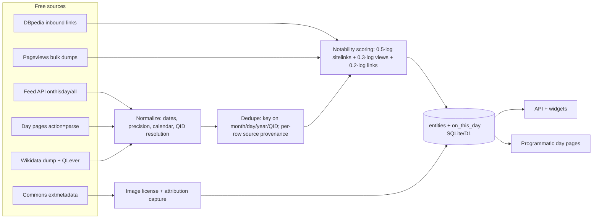
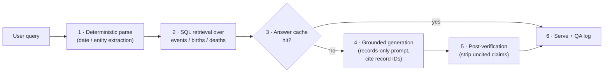

# OnThisDay.com Teardown & Build-Your-Own Blueprint
*Features, filters, data sources, SEO, and the AI-premium opportunity — research-backed build blueprint. Compiled 2026-07-19.*

## 1. Executive Summary

### 1.1 What onthisday.com is and why it wins

OnThisDay.com is the niche's proof of demand — and its complacent incumbent. A public scrape captured 226,209 dated entries across events, birthdays, deaths, and weddings (June 2022) [^D3-15^], multiplied into millions of templated pages monetized at a self-reported 1M+ visitors and 3M+ pageviews per month, 53% US [^D2-1^]; the most current third-party read is ~1.8M monthly visits (directional) [^D2-7^]. Revenue is an estimated $150K–$575K per year — base case $300K–$350K — effectively 100% from programmatic display ads [^D2-1^][^D2-7^]. The niche funds a lean, founder-run operation on ads alone; this report answers what a challenger can add that ads alone cannot buy.

The incumbent's moat is real but narrow: 25 years of editorial curation (© 2000–2026), not technology or network effects [^D1-1^]. Three exposures matter more. First, the raw corpus is free — the Wikimedia Feed API serves the same events, births, and deaths under CC BY-SA, Wikidata under CC0 [^D4-2^][^D4-11^][^D6-19^]. Second, every monetizable surface beyond ads is unclaimed — no API, widgets, premium tier, or accounts — and robots.txt blocks every major AI crawler [^D1-18^]. Third, cross-verification across eight rivals found none offering AI Q&A, faceted date×category filters, or embeds either: the gaps are industry-wide. The window is open because the category is static.

### 1.2 The build blueprint in one page

For a solo founder on Next.js/Cloudflare with an existing widgets marketplace, the plan is not to out-curate a 25-year archive but to rebuild the corpus from free sources in days, then win where the incumbent refuses to build. Table 1-1 compresses it.

**Table 1-1. The blueprint at a glance**

| Layer | Choice | Why |
|---|---|---|
| Data corpus | Wikimedia Feed API primary + day-page parsing + Wikidata dump + holiday APIs | $0 under CC BY-SA/CC0; full English corpus = 366 requests, ~438 items/day [^D4-2^][^D4-11^][^D6-19^] |
| Differentiated data | Weddings + anniversaries via Wikidata SPARQL (414,149 dated marriages) | No feed serves weddings; only the incumbent covers them [^D5-9^][^D3-15^] |
| Trust layer | Per-row source provenance + offline notability scoring | The corpus is a commodity; verification and packaging are the moat |
| Growth engine | Programmatic SEO: 366 date pages, category×date, date-math tools, 1,500+ national days | Date-history queries keep ~100% click capture; answer-box terms yield 2.5–26% [^D7-2^][^D7-3^][^D7-17^] |
| Distribution | Free embeddable widgets via the widgetly marketplace | No incumbent offers embeds; every embed is a backlink [^D1-18^] |
| Monetization — baseline | Programmatic display ads, $4–12 page RPM | Incumbent proves the niche: est. $150K–$575K/yr on 3–4M pageviews [^D2-1^][^D2-7^][^33^] |
| Monetization — premium | Verified AI answers $6/mo or $49/yr; $4.99 birthday reports; API $9–99/mo | LLM cost is $0.00032/answer, so >90% gross margin; no rival offers AI Q&A [^20^][^31^] |

Read the table as a capital-allocation statement. Because acquisition costs nothing, the engineering budget concentrates on the two assets that compound: verification (provenance, dedupe, notability) and packaging (facets, widgets, artifacts). Growth spend flows only to query classes that survive zero-click search; monetization is stacked so ads pay for traffic while the premium layers — the ones no incumbent offers — carry the margin. The outlier row is differentiated data: weddings cost one SPARQL recipe yet stand alone in the field. The one row that cannot be deferred is trust: retrofitting dedupe and provenance is the costliest mistake this build can make, so it ships in week one (Chapters 6 and 10).

Two findings steer execution. Growth must route around zero-click: 60% of question-word queries trigger an AI Overview, and organic clicks fall from 15% to 8% when one appears [^D7-20^], with top-position CTR down from ~28% to ~19% [^D7-22^]. Yet "this day in history" still converts ~100% of its estimated 61K monthly searches (third-party) to the #1 result [^D7-2^], and every date carries a predictable annual pulse — Wikipedia's "January 1" spikes from a ~1,300 daily baseline to 30,520 views [^D7-15^]. Defense doubles as offense: 99.5% of AIO-cited sources rank in the organic top 10, so winning templates also wins citations [^D7-23^]. Monetization follows the same evidence. GPT-4o scores below 40% on short-fact benchmarks while retrieval grounding cuts hallucinated entities ~70–90% [^14^][^17^]; hence the premium tier sells verification — "ChatGPT guesses dates; we look them up" — at $6/mo against the $20 general-AI anchor and $10–12/mo niche precedents [^1^][^36^], with $4.99 birthday reports riding a proven ~$20 gift-poster market [^31^] and API tiers priced under proven buyers [^28^][^30^].

The window will not stay open: AI Overviews grew from 6.5% of queries in January 2025 to a ~25% peak within months [^D7-19^], and nothing prevents an incumbent — or another indie — from bolting AI onto the same free corpus. The durable position is the verified database plus the widget link graph; both compound only if built now.

#### Sources — Chapter 1

*Citation convention: `[^D1-N^]` … `[^D7-N^]` preserve the Dimension-report indices as used in Chapter 10; unprefixed `[^N^]` markers preserve Dimension 08 indices as used in Chapters 8 and 10, except `[^33^]`, preserved from Chapter 3.*

- [^D1-1^]: https://www.onthisday.com/ — homepage (© 2000–2026, On This Day Pte. Ltd.) (via Ch.10)
- [^D1-18^]: https://www.onthisday.com/robots.txt — AI-bot blocklist, disallowed paths, no sitemap (via Ch.10)
- [^D2-1^]: OnThisDay.com — "Advertising Information" (via Wayback Machine, 29 Nov 2021). https://web.archive.org/web/20211129205834/https://www.onthisday.com/advertising.php (via Ch.10)
- [^D2-7^]: Exploding Topics / Semrush — onthisday.com traffic report (Jun 2026): ~1.8M visits, global rank 27,998. https://analytics.explodingtopics.com/website/onthisday.com (via Ch.10)
- [^D3-15^]: Kaggle — 226,209 events scraped from onthisday.com ("Events, Birthdays, Deaths, Weddings", June 2022). https://www.kaggle.com/datasets/draculax/226209-events-from-onthisdaycom (via Ch.10)
- [^D4-2^]: wikifeeds service README (route list incl. `onthisday` endpoints). https://github.com/wikimedia/mediawiki-services-wikifeeds (via Ch.10)
- [^D4-11^]: WMF/RESTBase terms — API content licensed CC BY-SA 3.0/GFDL. https://www.usenix.org/system/files/pepr22_slides_triedman.pdf (via Ch.10)
- [^D5-9^]: Executed count of Wikidata P26 statements with pq:P580 = 414,149 (QLever, 54 ms). https://qlever.dev/api/wikidata (via Ch.10)
- [^D6-19^]: Wikidata Query Service pattern (P569/P570 + MONTH/DAY filters; CC0). https://query.wikidata.org/sparql (via Ch.10)
- [^D7-2^]: Ahrefs public data — history.com top keywords ("this day in history" 61K #1). https://ahrefs.com/top/history.com (via Ch.10)
- [^D7-3^]: Ahrefs public data — nationaltoday.com top keywords ("what holiday is today" 149K #1, "what day is today" 86K #1), DR 83. https://ahrefs.com/top/nationaltoday.com (via Ch.10)
- [^D7-15^]: Wikimedia Pageviews API — en.wikipedia "January_1" daily 2023–2024 (baseline ~1,062–3,303; Jan 1: 30,520). https://wikimedia.org/api/rest_v1/metrics/pageviews/per-article/en.wikipedia/all-access/all-agents/January_1/daily/2023122000/2024011000 (via Ch.10)
- [^D7-17^]: AcadCalendar — "National Day Calendar 2026" (1,500+ observances, ~4–5 per date). https://acadcalendar.com/national-day-calendar/ (via Ch.10)
- [^D7-19^]: Semrush AI Overviews Study (10M+ keywords; AIO 6.49% Jan 2025 → ~25% Jul peak). https://www.semrush.com/blog/semrush-ai-overviews-study/ (via Ch.10)
- [^D7-20^]: Pew Research Center browsing study (Mar 2025, via Myoho Marketing) — 60% of question-word queries trigger AIO; organic clicks 15%→8% when AIO present. https://myohomarketing.com.au/ai-overviews-in-2025-what-pew-research-centers-click-data-means-for-publishers/ (via Ch.10)
- [^D7-22^]: WebProNews — "Google AI Overviews Crush CTRs" (top organic CTR 28%→19%). https://www.webpronews.com/google-ai-overviews-crush-ctrs-seos-2025-reckoning/ (via Ch.10)
- [^D7-23^]: Rayo blog synthesis of Semrush/SparkToro data (AIO sources = top-10 organic 99.5% of the time). https://blog.rayo.work/seo/ai-overviews-study/ (via Ch.10)
- [^1^]: Perplexity pricing breakdowns — free tier, Pro $20/mo, daily Pro-search caps. https://comparaitools.com/blog/perplexity-pricing-2026 ; https://aisotools.com/pricing/perplexity (via Ch.8)
- [^14^]: OpenAI SimpleQA — GPT-4o scores below 40% on 4,326 short factual questions. https://inblix.com/article/openai-s-simpleqa-exposes-gpt-4o-s-40-factuality-score-3fbe96/ (via Ch.10)
- [^17^]: ServiceNow/NAACL 2024 — RAG cuts hallucinated structured-output entities (13.7–16.0% → 1.7–7.2%). https://arxiv.org/html/2404.08189v1 (via Ch.10)
- [^20^]: Gemini 2.5 Flash-Lite pricing — $0.10/1M input, $0.40/1M output, cached $0.01/1M. https://devtk.ai/en/models/gemini-2-5-flash-lite/ (via Ch.10)
- [^28^]: Calendarific vs alternatives — free 500 req/mo w/ attribution; $12/mo entry; $400/yr business; $4,000/yr enterprise. https://worlddataapi.com/compare/calendarific (via Ch.10)
- [^30^]: Holiday API market — timeanddate API $99–999/yr. https://worlddataapi.com/compare/holiday-apis (via Ch.10)
- [^31^]: Personalised "year you were born" birthday newspaper poster — ~$20 digital download. https://www.milestonesstudio.com.au/products/year-in-review-birthday-newspaper (via Ch.8)
- [^33^]: Skipblast — "Ezoic Earnings: November 2024 Niche Site Income Report" (education site EPMV $3.79–5.41 on Ezoic vs $23–54 RPM on Mediavine / $20+ on Raptive). https://www.skipblast.com/ezoic-earnings-november-2024-niche-site-income-report/ (via Ch.3)
- [^36^]: Consensus — corpus-grounded answer engine at $10–12/mo Pro against free general AI. https://theaiagentindex.com/compare/elicit-vs-consensus-vs-perplexity-ai (via Ch.8)

---

## 2. OnThisDay.com Site Anatomy — Features and Filters

OnThisDay.com is not a list of facts; it is a lattice. A public scrape captured 226,209 dated entries across Events, Birthdays, Deaths and Weddings (June 2022 snapshot), and the site multiplies that single corpus into millions of templated pages by re-slicing it along date, type, channel, topic, and person dimensions [^20^]. The build lesson: the entry schema is trivially simple, and all defensibility sits in the filter lattice, the computed person attributes, and a thin editorial layer. This chapter maps the modules, filters, and URL grammar worth cloning, then the five flanks left open.

### 2.1 Homepage and content modules

The homepage is the daily-rendered front page of the whole database. Under the title "On This Day — Today in History, Film, Music and Sport," fourteen stacked modules each open a storefront window into a different slice of the corpus, with a universal filter bar (keyword + day + month + type) repeated in header and footer [^1^]. Three modules are computed live against the current date — a pattern worth stealing, because it makes the page self-updating with zero daily editorial labor.

**Table 2-1. Homepage module inventory (top → bottom, as rendered July 19) [^1^]**

| # | Module | What it renders | Mechanics / link target |
|---|---|---|---|
| 1 | Today in History | 5 photo-highlighted events with year links, person links, footnote citations `[1][2]` | `highlight` flag → h3 + image; links to year/photo pages [^1^] |
| 2 | Historical Events Today | Extended chronological event list | Auto from Events table [^1^] |
| 3 | Events in 2025 | Current-year happenings | Auto: year filter [^1^] |
| 4 | Today in Sport | Channel teaser (1877 first Wimbledon, 1903 first Tour de France) | Auto: Sport channel filter [^1^] |
| 5 | Take Our Weekly Quiz! | Multi-choice quiz call-to-action | Weekly URL `/quiz/{month}/{dd}-{dd}` [^1^] |
| 6 | Did You Know? | One fun fact with full date ("July 19, 2001") | `fun_fact` flag [^1^] |
| 7 | Famous Birthdays | 6 deceased figures with lifespan ranges | Birthdays table [^1^] |
| 8 | Celebrity Birthdays | Living celebrities with photos and ordinal ages ("Ilie Năstase 80th Birthday") | **Computed live** from `birth_date` [^1^] |
| 9 | Famous Weddings | Entries with **both partners' ages** ("John Dickinson (37) weds… Mary Norris (30)") | Ages computed at event date [^1^] |
| 10 | Famous Divorces | Filings with marriage-duration notes | Divorces table [^1^] |
| 11 | Famous Deaths in History | 6 entries with lifespans + "Deaths in August 2025" month index | Deaths table [^1^] |
| 12 | Featured Article | Long-form teaser card with event date | `/articles/{slug}` [^1^] |
| 13 | Famous Americans | Nationality module (Lincoln, Washington, MLK Jr.) | `/people/nationality/american` [^1^] |
| 14 | Footer | Filter bar, "Get Our Daily Email" newsletter, About/Corrections/Privacy, social icons | Newsletter = only retention channel [^1^] |

The stack is a cross-sell engine, not decoration: every module deep-links into a page family (year pages, profiles, topics, articles), turning one landing visit into the multi-page sessions that feed the ad model. The rebuild ratio that matters: eleven of fourteen modules are pure database queries, two (quiz, featured article) are light weekly editorial, and only photo highlights need per-entry human work. The live age labels in modules 8–9 are the highest-leverage trick — a `birth_date` column plus date math yields "80th Birthday today" headlines that feel freshly written each morning. All fourteen are reproducible in Next.js as static components with daily revalidation in the first build sprint.

### 2.2 Feature-by-feature filter matrix

Filtering is the product. Every page carries the same bar — keyword, All Days (1–31), All Months, All Types (Events/Birthdays/Deaths/Weddings) — and each feature adds its own facet axes (a *facet* = a filterable attribute that spawns its own index-page family) [^1^]. Table 2-2 consolidates the matrix.

**Table 2-2. Feature × filter matrix**

| Feature | Filters | URL pattern | Notes |
|---|---|---|---|
| Date overview | day, month, type tabs, channel tabs, prev/next | `/day/{month}/{day}` [^2^] | Aggregates all four types + articles, photos, quiz |
| Events by date | day, month, channel | `/events/{month}/{day}` [^3^] | Chronological back to year 64; highlights get h3 + image + footnotes |
| Events by year | year, month anchors, channel | `/events/date/{year}` ≡ `/date/{year}` [^4^][^5^] | Adds "{year} in Music/Sport," awards, World Leaders |
| Events by full date | year + month + day | `/date/{year}/{month}/{day}` [^5^] | Single-day-in-year pages |
| Birthdays | day, month, channel variants (actors/musicians/athletes) | `/birthdays/{month}/{day}` [^10^] | `[OS]` Old Style flag; living people get computed ordinal age |
| Deaths | day, month, year, channel | `/deaths/{month}/{day}`, `/deaths/date/{year}` [^11^] | Rows carry cause/manner + age at death |
| Weddings & Divorces | day, month, year | `/weddings/{month}/{day}`, `/weddings/date/{year}` [^12^] | Both partners' ages; divorces note duration |
| Channel hubs ×3 | Today / Events / Birthdays / Deaths / By Year / By Day / Topics | `/film-tv/`, `/music/`, `/sport/` [^6^][^13^][^14^] | Channel-scoped search; Weddings dropped |
| Topic taxonomies | topic → subtopic (2 levels) | `/{channel}/{topic}/{subtopic}` [^7^][^8^][^13^][^15^] | 22 film/TV awards, 11 music awards, 30+ sports |
| People engine | age group, generation, nationality, 100+ professions, star sign, Chinese zodiac, cause of death, Top 100, A–Z | `/famous-people.php` + `/people/{axis}/{value}` [^16^] | Nine facet axes — deepest filter set on site |
| Search | keyword + day + month + type; channel variants | `/search.php`, `/{channel}/search.php` [^17^] | Results via POST/JS — not URL-addressable |
| Country lenses | US, UK, China, Australia | `/today/american-history.php` etc. [^1^][^10^] | Geo-SEO "today" variants |
| Quiz | weekly date range | `/quiz/{month}/{dd}-{dd}` [^1^] | "Challenge your friends" hook |

Three conclusions fall out. First, every facet axis is a page family: the nine people axes spawn hundreds of index pages from one table, which is why computed attributes (zodiac, generation, age band) repay their storage cost many times over. Second, taxonomy investment is asymmetric — Film & TV, Music, and Sport each get a curated two-level tree, while the flagship History channel has **no topic layer at all** [^6^][^7^][^13^][^15^]. Third, search is architecturally weak: POST/JS results have no stable URLs [^17^], so the incumbent indexes nothing for "person + date" long-tail queries. A challenger shipping server-rendered, URL-addressable faceted search claims an entire query class OnThisDay.com structurally cannot rank for.

### 2.3 URL architecture and programmatic-SEO grammar

The site's programmatic SEO (page templates generated from database dimensions at scale) follows one principle: every entry is addressable through a lattice of dimensions — date (day/month/year/full-date) × type × channel × topic × person attribute [^3^][^16^]. Table 2-3 is the clone-ready map.

**Table 2-3. URL grammar map**

| URL pattern | Renders | Template title example | Approx. family size |
|---|---|---|---|
| `/day/{month}/{day}` | All-types date overview | "What Happened on July 19" [^2^] | 366 |
| `/{type}/{month}/{day}` (events, birthdays, deaths, weddings) | Type-filtered day list | "Historical Events on July 19" [^3^]; "Famous Deaths on July 19" [^11^]; "Famous Wedding Anniversaries on July 19" [^12^] | 366 × 4 ≈ 1,464 |
| `/events/date/{year}` ≡ `/date/{year}` | Year overview | "What Happened in 1990" [^4^][^5^] | ~2,000 years × 4 types |
| `/date/{year}/{month}/{day}` | Single full date | Event permalinks [^5^] | Effectively unbounded |
| `/today/*.php` | Legacy "today" endpoints | "Today's Famous Birthdays" [^9^][^10^] | 5+ |
| `/today/{country}-history.php` | Country-lens today | [^1^][^10^] | 4 observed |
| `/{channel}/` + `/{channel}/events.php` etc. | Channel hubs + day/year lists | "Today in Movie and TV History" [^6^][^14^] | 3 channels × ~6 views |
| `/{channel}/{topic}/{subtopic}` | Two-level topic pages | "Hollywood in History" [^7^][^8^] | 100+ topics |
| `/people/{slug}`; `/people/{plural}`; `/people/profession\|nationality\|generation\|star-sign/{x}`; `/people/starting-with-{a–z}` | Profiles + people lists | People-hub facets [^16^] | 100+ professions, dozens of axes |
| `/articles/{slug}`, `/photos/{slug}`, `/quiz/{month}/{dd}-{dd}` | Editorial layer | [^1^][^17^] | Weekly cadence |

Titles are machine-generated per dimension combination, breadcrumbs and sibling-topic links reinforce the taxonomy, and every year, name, and date in every entry is a hyperlink — near-perfect internal linking for free [^2^][^3^][^4^][^8^][^10^][^11^][^12^]. Two imperfections matter to a cloner: legacy `.php` endpoints coexist with clean paths (both live; canonicalization unverified), and pagination leaks through query strings (`?p=2…12`) [^16^]. Most tellingly, `robots.txt` declares no sitemap and blocks every major AI crawler — GPTBot, ClaudeBot, PerplexityBot, CCBot, Bytespider, Meta-ExternalAgent [^18^]. Recommended posture: replicate this grammar one-for-one as statically generated routes, fix the duplication and pagination hygiene, then extend with the axes the incumbent lacks (history topics, combined facets).

### 2.4 Entry content model and editorial layering

The schema is small. A base **event entry** carries `year` (linked; supports antiquity, e.g. 64 AD), `month`, `day`, 1–2 sentences of encyclopedic text, linked `persons[]`, channel tags, and topic tags [^1^][^3^]. A `highlight` flag promotes an entry into the editorial layer: an h3 display title ("Mansa Musa Arrives in Cairo"), a captioned image, sometimes a linked photo feature, and footnote citations `[1][2]` underpinning the "most accurate independent site" brand [^1^][^3^]. A **person record** carries name, slug, birth date (with `[OS]` Old Style flag for pre-Gregorian dates), nullable death date driving living/deceased logic, birthplace, nationality, professions, cause of death, popularity rank, and image [^10^][^11^][^16^]; everything else — current age, age at death, star sign, Chinese zodiac, generation, age group — is computed [^16^]. List rows are equally templated: birthdays render "Name, nationality + profession, born in PLACE (d. YEAR)"; deaths "Name, descriptor, cause/manner, dies at AGE"; weddings give both partners' ages; divorces note duration [^10^][^11^][^12^].

Implication: the schema is a weekend build, and computed attributes generate entire page families at zero marginal cost. The only genuinely expensive layer is 25 years of highlight titles, captions, and footnotes — exactly where a verification-first data pipeline (Chapter 5) must substitute for editorial headcount.

### 2.5 What is missing (the open flanks)

Five absences define the competitive opening:

1. **No public API, widgets, or embed tools** anywhere in navigation or footers; `robots.txt` blocks every major AI crawler — content is protected, never syndicated [^1^][^18^].
2. **No accounts or personalization** — no "on this day in your life," birthday-twin, or saved-interest features [^1^].
3. **No date calculators or visualizations** — no age/date-difference tools, maps, or timelines; the product is read-only lists [^1^][^17^].
4. **No History topic taxonomy** — topic trees exist only for entertainment and sport; there are no WWII, Space, Disasters, or Science pages [^6^][^7^][^13^][^15^].
5. **No indexable search results** — POST/JS rendering means zero long-tail landing pages [^17^].

Cross-verification across eight profiled competitors confirms none fills the API, widget, or faceted-filter gap either — an industry-wide blind spot, not a single-incumbent oversight [^22^]. Each missing piece is also unclaimed revenue: APIs, widgets, and personalization are precisely the monetizable surfaces an ads-only model cannot fund. Chapter 3 quantifies that model — and what these openings are worth.

#### Sources — Chapter 2

[^1^]: https://www.onthisday.com/ — homepage (nav, modules, filter bar, footer, newsletter, consent)
[^2^]: https://www.onthisday.com/day/july/19 — "What Happened on July 19" date overview page
[^3^]: https://www.onthisday.com/events/july/19 — "Historical Events on July 19" full event list
[^4^]: https://www.onthisday.com/events/date/1990 and https://www.onthisday.com/date/1990 — "What Happened in 1990" year page
[^5^]: https://www.onthisday.com/date/1990 — year page modules (Did You Know `/date/1990/may/17`, births/deaths by channel, awards, World Leaders)
[^6^]: https://www.onthisday.com/film-tv/ — "Today in Movie and TV History" channel hub (sub-nav: Today/Events/Birthdays/Deaths/By Year/By Day/Topics)
[^7^]: https://www.onthisday.com/film-tv/topics.php — "Film & Television History by Topic" taxonomy
[^8^]: https://www.onthisday.com/film-tv/film/hollywood — "Hollywood in History" topic page (breadcrumbs, ISO full-date links)
[^9^]: https://www.onthisday.com/today/events.php — "Today in History" (weddings link `/today/weddings-divorces.php`)
[^10^]: https://www.onthisday.com/today/birthdays.php — "Today's Famous Birthdays" (entry format, [OS] flag, `/birthdays/date/{year}`, `/today/australian-history.php`)
[^11^]: https://www.onthisday.com/deaths/july/19 — "Famous Deaths on July 19" (cause/age-at-death format, `/deaths/date/{year}`)
[^12^]: https://www.onthisday.com/weddings/july/19 — "Famous Wedding Anniversaries on July 19" (both partners' ages, `/weddings/date/{year}`)
[^13^]: https://www.onthisday.com/music/genres.php — "Music History by Genre" taxonomy
[^14^]: https://www.onthisday.com/sport/ — "Today in Sports History" channel hub
[^15^]: https://www.onthisday.com/sport/sports.php — "Sports History by Sport" full taxonomy
[^16^]: https://www.onthisday.com/famous-people.php and https://www.onthisday.com/people/professions.php — people hub (Age/Generation/Country/Profession/Star Sign/Zodiac/Cause of Death/Top 100/A–Z) + paginated professions `?p=1..12`
[^17^]: https://www.onthisday.com/search.php — search form + index links (Calendar, Dates, People, Articles, Photos, Quiz)
[^18^]: https://www.onthisday.com/robots.txt — AI-bot blocklist (GPTBot, ClaudeBot, PerplexityBot, CCBot, Bytespider, Meta-ExternalAgent), disallowed paths, no sitemap
[^20^]: Kaggle dataset "226,209 Events From onthisday.com" (Events, Birthdays, Deaths, Weddings; as of 2022-06-28) — via https://www.selectdataset.com/dataset/057611ee4ac2fed10f2b992a4d9171d1
[^22^]: Competitor matrix research file `onthisday_dim03_competitor_matrix.md` — feature matrix rows 25–26 (syndication/API, accounts) and gap analysis #1/#8 (no competitor offers REST API, embeddable widgets, or faceted date×category filtering); cross-checked across Britannica, History.com, BBC On This Day, timeanddate, Famous Birthdays, On-This-Day.com, Library of Congress, Histoday

---

## 3. Business Model and Traffic Economics

Chapter 2 closed on a structural gap — no API, no widgets, no premium tier — and this chapter prices that gap. OnThisDay.com is a single-engine business: a founder-run publisher converting 3–4 million monthly pageviews into an estimated $150K–$575K per year, entirely from programmatic display ads, base case near $300K–$350K [^1^][^7^]. The model proves the niche funds a lean operation on ads alone — and maps the revenue layers the incumbent refuses to build.

### 3.1 Traffic and audience

The most reliable traffic figure is the one the site sells against: its advertising page claims "over 1m visitors serving over 3m page views a month," split 53% US, 15% UK, 5% Canada, 3% Australia — roughly 76% Tier-1 English markets, the geographies that command premium ad rates [^1^][^29^]. Third-party estimators disagree by a factor of six and are directional only.

**Table 3-1. Self-reported vs. third-party traffic estimates for OnThisDay.com**

| Source | Data date | Monthly visits | Monthly pageviews | Assessment |
|---|---|---|---|---|
| Self-reported (advertising page) [^1^] | 2021 | 1M+ | 3M+ | Verified verbatim via Wayback capture; safest planning baseline |
| Semrush / Exploding Topics [^7^] | Jun 2026 | ~1.8M | n/a | Most current read; global rank 27,998; Authority Score 62 |
| Worth Of Web [^6^] | ~mid-2022 | ~1.37M | ~6.85M | Alexa-derived; pageview figure looks inflated |
| SiteWorthTraffic [^5^] | ~2021 | ~308K | ~683K | Alexa-derived; implausibly far below self-report |

The spread between the two Alexa-era tools (308K vs 1.37M visits in adjacent years) is a calibration lesson: free estimators bracket rather than measure, so the defensible anchors are the self-report and the current Semrush read [^5^][^6^][^7^]. Reconciling them implies growth — at ~2.2 pages per visit, 1.8M visits works out to roughly 4M pageviews per month today versus 3M claimed in 2021 [^7^]. Two implications follow. The niche sustains multi-million-pageview scale on evergreen, templated content with no news operation — the exact traffic profile a programmatic challenger can replicate. And quick-fact sessions are shallow and high-bounce, so revenue scales with pageview volume and ad viewability, not engagement depth.

### 3.2 Monetization mechanics

The engine is ~100% programmatic display, with direct-sold sponsorships layered on top [^1^]. Ads run through Google Ad Manager (the rate page names DFP, its predecessor), with SHE Media as mid-tier ad-management partner and a consent-management platform disclosing 1,727 ad partners [^1^][^36^]. The rate card sells four products: 728x90 leaderboard and 300x250 medium-rectangle banners; channel buys across seven sections (Home, History Articles, Film & Television, History, Music, Sport, People); co-branded page takeovers ("This page brought to you by ___"); and daily-newsletter sponsorship — all targetable by country, continent, or hour of day, with frequency capping [^1^]. A Spanish sister site, Hoy en la Historia, extends the same inventory [^1^].

Equally instructive is what the stack lacks: no premium or ad-free subscription, no paid API or data-licensing product — third parties such as Viewbits sell "on this day" API access instead [^27^] — and no affiliate commerce [^1^]. The implication: the incumbent's entire P&L depends on one demand channel, leaving subscription, API, and licensing revenue unclaimed for a competitor.

### 3.3 Revenue model and niche RPM benchmarks

Combining 3.0–4.0M monthly pageviews with a page-RPM band of $4–$12 (RPM = revenue per thousand pageviews) yields an estimated $150K–$575K per year, base case roughly $300K–$350K [^1^][^7^].

**Figure 3-1. Revenue sensitivity: monthly pageviews × page RPM (annualized)**


Three judgment calls set the RPM band. 1) Mix: education/reference is a premium vertical — Playwire reports it "carries the highest average CPM of any content vertical" — and ~76% Tier-1 geography pushes rates up [^31^][^29^]. 2) Session quality: shallow ~2.2-page visits cap session value. 3) Network tier: real-world education-site RPMs span $3–5 on Ezoic to $20–54 on Mediavine/Raptive, and OnThisDay's mid-tier Google + SHE Media stack argues for the $4–12 band rather than the premium ceiling [^33^][^32^]. Independent cross-checks land inside the range: Worth Of Web's model estimates ~$247K/yr, and publisher benchmarks put 1.5–10M-pageview sites at $3K–$20K per month [^6^][^34^]. Planning rule: at base RPMs, every 1M monthly pageviews is worth $8K–$12K per month — and upgrading to a premium ad network later is a near-pure-margin lever, since the traffic is unchanged.

### 3.4 Ownership and history

The operator is On This Day Pte. Ltd. (Singapore), founded and still run by managing editor James Graham, a showcased Google AdSense publisher — ads have been the model from early on [^3^][^4^][^2^]. The archive began as HistoryOrb.com on 22 December 2000, evolved from a database originally collated by Bruce T. Goldman, and rebranded to OnThisDay.com on 21 July 2015 [^2^]. A 25-year-old, founder-led shop with no outside capital and one monetization engine is a profitable-but-static incumbent: its moat is accumulated editorial curation, not technology or network effects.

### 3.5 Comparables' monetization

The niche's other players prove that three monetization layers — ads, subscriptions, and data licensing — are all viable; OnThisDay uses only the first.

**Table 3-2. Monetization models of comparable properties**

| Property | Primary model | Premium / subscription | Paid API / data product | Reported scale |
|---|---|---|---|---|
| OnThisDay.com | Programmatic display + newsletter/co-brand sponsorships [^1^] | None | None (3rd-party APIs fill gap [^27^]) | ~1.8M visits/mo [^7^] |
| timeanddate.com | Ads + four paid APIs + freemium apps | In-app ad-free purchase | Time $49–399/yr; Astronomy $99–499/yr; Holidays (incl. "On This Day" data) $99–999/yr; Date Calculator $299–599/yr [^11^][^12^][^13^][^14^] | ~23M uniques/mo (2021) [^16^] |
| FamousBirthdays.com | ~100% programmatic display + video [^8^] | None (chose enterprise over consumer) | Famous Birthdays Pro trend data sold to platforms/agencies [^9^] | 25M uniques, 500M+ impressions/mo (2020) [^8^] |
| History.com (A+E) | Ads + TV + brand extensions | HISTORY Vault SVOD $5.99/mo or $59.99/yr [^20^] | Alexa "This Day in History" skill; live events [^21^] | Cable-network companion |
| Calendarific | API vendor | — | Holiday API: free 500 calls/mo; Starter $12/mo; Enterprise $4,000/yr [^23^] | 230+ countries |
| API-Ninjas | API vendor | — | Historical Events / Day-in-History APIs: $39–199/mo tiers [^25^][^26^] | 125+ APIs |

Three patterns should steer the founder's model. First, data licensing is the most repeated diversifier: timeanddate sells the very same "on this day" dataset inside its $99–999/yr Holidays API, and two independent vendors retail comparable feeds at $12–199 per month — proven demand at price points a solo founder can match [^13^][^23^][^25^]. Second, consumer willingness to pay attaches to packaged depth, not raw facts: HISTORY Vault monetizes ad-free long-form video at $5.99/mo [^20^], while Calendarific and API-Ninjas commoditize the data cheaply [^23^][^25^]. Third, scale is no prerequisite for B2B data revenue — Famous Birthdays built its Pro product on audience-trend data any traffic-bearing site generates [^9^]. Net implication: pair a free, widget-distributed content layer for acquisition with paid tiers where the incumbent is absent — API access, premium artifacts, sponsorship inventory — rather than competing for its ad dollars alone. Chapter 4 maps the full competitive field behind those openings — eight rivals and a mobile vanguard — and isolates the twelve capability gaps none of them covers.

#### Sources — Chapter 3

[^1^]: OnThisDay.com — "Advertising Information" (via Wayback Machine, 29 Nov 2021). https://web.archive.org/web/20211129205834/https://www.onthisday.com/advertising.php
[^2^]: OnThisDay.com — "About Us" (via Wayback Machine, 2 Jan 2022). https://web.archive.org/web/20220102221238/https://www.onthisday.com/about.php
[^3^]: Crunchbase — "On This Day" company profile (On This Day Pte. Ltd.). https://www.crunchbase.com/organization/onthisday-com
[^4^]: The Tech Startup Channel — APAC startup listing naming "James Graham, Founder and managing editor at OnThisDay.com" (18 Dec 2017). https://thetechstartupchannelshow.wordpress.com/2017/12/16/were-looking-to-crown-apacs-most-promising-startups-are-you-the-top100connect-with-asias-top-tech-investors/
[^5^]: SiteWorthTraffic — Onthisday.com traffic/revenue report (~2021). https://www.siteworthtraffic.com/report/onthisday.com
[^6^]: Worth Of Web — onthisday.com valuation/traffic (~2022). https://www.worthofweb.com/website-value/onthisday.com/
[^7^]: Exploding Topics / Semrush — onthisday.com traffic report (Jun 2026): ~1.8M visits, global rank 27,998. https://analytics.explodingtopics.com/website/onthisday.com
[^8^]: Digiday — "How Famous Birthdays is building a growing media company on the back of programmatic ads" (30 Jan 2020). https://digiday.com/media/famous-birthdays-building-growing-media-company-back-programmatic-ads/
[^9^]: The Rebooting — "How Famous Birthdays built a data business from celebrity searches" (14 Feb 2022). https://www.therebooting.com/p/how-famous-birthdays-built-a-data-657bd9cb27b6682ed0d34f65
[^11^]: timeanddate.com API Services — Time API pricing. http://dev.timeanddate.com/time/pricing
[^12^]: timeanddate.com API Services — Astronomy API pricing. https://dev.timeanddate.com/astro/pricing
[^13^]: timeanddate.com API Services — Holidays API pricing (includes "On This Day" service). https://dev.timeanddate.com/holidays/pricing
[^14^]: timeanddate.com API Services — Date Calculator API pricing. https://dev.timeanddate.com/calculator/pricing
[^16^]: SiteWorthTraffic — timeanddate.com report (~2021). https://www.siteworthtraffic.com/report/timeanddate.com
[^20^]: HISTORY Vault Support — "How much does a HISTORY Vault subscription cost?" ($5.99/mo, $59.99/yr). https://support.historyvault.com/hc/en-us/articles/360058889513
[^21^]: A+E Global Media — "HISTORY®" brand portfolio (HISTORY Vault, HISTORYTalks, Alexa "This Day in History" skill, AlienCon). https://www.aegm.com/brands/history
[^23^]: Calendarific — Global Holiday Calendar API, Plans & Pricing. https://calendarific.com/
[^25^]: API Ninjas — Historical Events API docs (commercial use requires premium; related "Day in History" API). https://api-ninjas.com/api/historicalevents
[^26^]: API Ninjas — Pricing (Developer $39/mo, Business $99/mo, Professional $199/mo, Enterprise). https://api-ninjas.com/pricing
[^27^]: Viewbits — "On This Day API Documentation" (freemium third-party on-this-day JSON API) (17 Nov 2024). https://viewbits.com/docs/on-this-day-api-documentation
[^29^]: Ranktracker — "Comparing AdSense RPM in High-Income vs. Low-Income Regions" (US/CA/UK RPM $20–50+) (27 Jan 2025). https://www.ranktracker.com/blog/comparing-adsense-rpm-in-high-income-vs-low-income-regions/
[^31^]: Playwire — "Education Publisher Ad Revenue Monetization" ("education carries the highest average CPM of any content vertical") (5 May 2026). https://www.playwire.com/blog/education-publisher-ad-revenue-monetization-the-lesson-loop-advantage
[^32^]: EliteWealthPlan — "Mediavine vs AdThrive vs Ezoic" (avg RPM: Ezoic $11.93, Mediavine $24.35, Raptive $32.47) (1 Jul 2026). https://elitewealthplan.com/mediavine-vs-adthrive-vs-ezoic/
[^33^]: Skipblast — "Ezoic Earnings: November 2024 Niche Site Income Report" (education site EPMV $3.79–5.41 on Ezoic vs $23–54 RPM on Mediavine / $20+ on Raptive) (30 Nov 2024). https://www.skipblast.com/ezoic-earnings-november-2024-niche-site-income-report/
[^34^]: Next Millennium — "How Much Do Websites Make from Ads?" (1.5–10M pageview sites = $3K–$20K/mo at $2–15 RPM) (3 Mar 2026). https://nextmillennium.com/blog/how-much-do-websites-make-from-ads
[^36^]: Research file `onthisday_dim01_site_anatomy.md` — live-site observation of Google DoubleClick/Ad Manager ads and consent banner listing "1727 partners" (https://www.onthisday.com/)

---

## 4. Competitor Landscape and Gap Analysis

The competitive field splits cleanly into two camps that never overlap: institutions with authoritative content but rigid products, and consumer products with engaging mechanics but unvetted data. That split is the founding opportunity: every capability needed to beat onthisday.com exists somewhere in the field, yet no rival holds more than two of the decisive ones — and twelve capabilities are unserved by anyone (4.4).

### 4.1 The field: eight web rivals and a mobile vanguard

**Britannica** is the editorial authority: a reverse-chronological daily timeline of events, births and deaths (only ~7–10 items per day), with every entry deep-linked into encyclopedia articles and quizzes, monetized through Premium subscriptions [^1^]. Its weakness is interaction — no filtering, one photo per item. **History.com** is the video play: multi-story daily pages with read-time labels and "Born on This Day" celebrity cards, funneling users into HISTORY Vault SVOD (subscription video on demand) — ad-heavy, US-centric, no deaths or weddings [^2^]. **BBC On This Day** remains the taxonomy benchmark: original news reports as they broke (archive roughly 1950–2005) organized into 8 themes and ~60 subcategories, with AV clips and community "Witness" memories — but frozen around 2008 and UK-centric [^3^][^4^].

**timeanddate** is the data utility: thin daily blurbs (~5 events) wrapped around the field's only country-aware holiday layer — a ~240-country picker and printable-calendar tool [^5^] — and it already monetizes that data through paid APIs, including an "On This Day" service [^17^]. **Famous Birthdays** is the engagement machine: community-sourced celebrity birthdays with live age calculation, "boost" voting, trending charts, five trivia modes and a reminders app [^6^][^13^], worth ~14.3M visits/month on Ahrefs' third-party estimate [^16^] — but zero historical events and unvetted data. **On-This-Day.com** (hyphenated; a different company from the baseline) owns niche vertical depth — music, TV, war, U.S. states, artist sub-sites — plus the field's only content-syndication feeds, all on a dated static-HTML stack [^7^]. The **Library of Congress'** Today in History is the trust ceiling: one long-form essay per day built on genuine primary sources, fact-checked by reference librarians — one event per day, no interactivity [^8^][^9^].

Product innovation has migrated to mobile. **Histoday** bundles 10 smart categories with 20 thematic tags, interest-based personalization, AI summaries and an "Ask AI" chat, quiz streaks and a What-If alternate-history mode behind a $15/year premium tier [^10^]; Wikipedia-based apps add century grouping and six-language reach [^11^][^12^]. The baseline onthisday.com sits in the middle: four content types (events, birthdays, deaths, weddings) across a 226,209-record corpus [^15^] — broad but mechanically shallow, as the matrix shows.

### 4.2 The condensed feature matrix

The full 34-row matrix is condensed to the 19 rows that change a build decision, dropping rows where everyone is identical (free-text search, day browsing) and merging quizzes with gamification. Legend: ✅ core strength · 🟡 partial/limited · ❌ absent. The baseline column is medium confidence, corroborated by a public scrape [^15^].

| Capability | Britannica | History.com | BBC | timeanddate | Famous Birthdays | On-This-Day.com | LOC | Mobile apps | onthisday.com |
|---|---|---|---|---|---|---|---|---|---|
| Historical events | ✅ curated timeline | ✅ multi-story/day | ✅ original reports | ✅ ~5/day | ❌ | ✅ | ✅ 1 essay/day | ✅ | ✅ |
| Famous births | ✅ in timeline | ✅ photo cards | 🟡 royalty only | ✅ | ✅ core product | ✅ | ❌ | ✅ | ✅ |
| Deaths | ✅ with age | 🟡 not a section | 🟡 royalty only | ✅ | 🟡 lifespan label | 🟡 in topic pages | ❌ | ✅ | ✅ |
| Weddings / divorces | ❌ | ❌ | 🟡 royal theme | ❌ | ❌ | ❌ | ❌ | ❌ | ✅ [^15^] |
| Holidays / observances | ❌ | ❌ | ❌ | ✅ by country [^5^] | ❌ | ❌ | ❌ | 🟡 | 🟡 |
| Primary sources / archival docs | ❌ | 🟡 photos | ✅ reports + AV | ❌ | ❌ | ❌ | ✅ best-in-class [^9^] | ❌ | ❌ |
| Video content | ❌ | ✅ shows/Vault [^2^] | ✅ archive clips | ❌ | ✅ video section | ❌ | ❌ | 🟡 | 🟡 |
| Category / topic filters | ❌ | 🟡 site hubs | ✅ ~60 subcategories [^4^] | ❌ | 🟡 profession tags | ✅ topic sub-sites | 🟡 topic search | ✅ 10 cats + 20 tags [^10^] | ✅ |
| Country / region filter | ❌ | 🟡 U.S./World hubs | 🟡 war regions | ✅ ~240 countries [^5^] | ❌ | 🟡 U.S. states | 🟡 U.S.-focused | ❌ | 🟡 |
| Profession filter | ❌ | ❌ | ❌ | ❌ | ✅ on every card [^6^] | ❌ | ❌ | ❌ | 🟡 |
| Live age calculation | ❌ | 🟡 years only | ❌ | ❌ | ✅ signature [^6^] | ❌ | ❌ | 🟡 | ✅ |
| Quizzes / gamification | ✅ quiz cross-links | ❌ | ❌ | ❌ | ✅ boosts + 5 game modes [^13^] | ❌ | ❌ | ✅ streaks, leaderboard [^10^] | 🟡 |
| Email newsletter | ✅ | ✅ daily | 🟡 RSS instead | ❌ | ❌ | ❌ | ❌ | 🟡 push instead | ✅ |
| Native mobile app | ❌ | ✅ | ❌ | ❌ | ✅ | 🟡 mobile site only | ❌ | ✅ core product | ✅ |
| Feeds / API / syndication | ❌ | ❌ | 🟡 RSS | ❌ | ❌ | ✅ B2B feeds [^7^] | ❌ | ❌ | 🟡 widgets |
| Accounts / personalization | 🟡 | ✅ free profile | ❌ | 🟡 | 🟡 app boosts | ❌ | ❌ | ✅ interests, favorites [^10^] | ❌ |
| AI features | 🟡 site chatbot | ❌ | ❌ | ❌ | ❌ | ❌ | ❌ | ✅ summaries + Ask AI [^10^] | ❌ |
| Data model | Editorial | Editorial | Archive + community | Aggregated + holiday DB | Community + moderation | Small-team curated | Librarians | Wikipedia/Wikidata + AI | Aggregated/editorial |
| Monetization | Premium subs | Ads + Vault SVOD | None (public service) | Ads + paid APIs [^17^] | Ads + app | Ads + feed licensing | None (government) | Freemium $15/yr [^10^] | Ads |

Read column-wise, events, births and date browsing are ✅ nearly everywhere: required for entry, conferring no advantage. The decision content sits in the ❌-dense rows — weddings, profession filters, country filtering, syndication/API, AI and personalization each have at most one credible ✅ across nine products, and no single product holds more than two of them. Read row-wise, the central trade-off appears: the institutions (Britannica, BBC, LOC) win every trust-and-sourcing row and lose every interaction row; the consumer products (Famous Birthdays, the mobile apps) invert that exactly. The baseline's breadth is real but shallow — onthisday.com matches the field feature-for-feature rather than exceeding it, and weddings is the only row where it stands alone [^15^]. A challenger need not out-build any single rival; it must be the first product to hold the trust rows and the interaction rows simultaneously.

### 4.3 Best-in-class per capability

Benchmarking should be capability-by-capability, not rival-by-rival. Nine capabilities, nine different owners:

| Capability | Benchmark | What to take from them |
|---|---|---|
| Category taxonomy | **BBC On This Day** | Two-level IA: 8 themes, ~60 subcategories [^4^] |
| Engagement mechanics | **Famous Birthdays** | Live age math, boosts, trending charts, trivia, reminders [^6^][^13^] |
| Sourcing & trust | **LOC Today in History** | Primary documents + librarian fact-checking [^8^][^9^] |
| Editorial cross-linking | **Britannica** | Every entry deep-links into articles and quizzes [^1^] |
| Holidays-by-country | **timeanddate** | ~240-country picker; printable calendars; paid data APIs [^5^][^17^] |
| Niche verticals & B2B feeds | **On-This-Day.com** | Music/TV/war/state sub-sites; syndication [^7^] |
| Mobile UX, AI & gamification | **Histoday** | AI summaries, Ask-AI, What-If mode, streaks at $15/yr [^10^] |
| Video monetization | **History.com** | Daily content as a Vault SVOD funnel [^2^] |
| Weddings coverage | **onthisday.com (baseline)** | The only player with the category [^15^] |

The fragmentation in this table is the finding: no owner is strong outside its own row. Cloning the incumbent imports its ceiling — an ads-only, feature-shallow product — so the correct move is assembly. Take BBC's two-level taxonomy as the information-architecture skeleton [^4^], Famous Birthdays' age math and trend mechanics as the engagement layer [^6^][^13^], LOC's citation discipline as the trust layer [^8^][^9^], timeanddate's country dimension as the localization pattern [^5^], and Histoday's category-plus-AI bundle as the premium-tier template [^10^]. Because each benchmark is weak everywhere except its own row, reaching parity in three or four of these capabilities — while owning the gap rows below — is sufficient for category leadership, not just differentiation.

### 4.4 The twelve gaps nobody covers

Twelve capability gaps remain unserved at quality across the nine products, but they are not equal — the ranking below weighs differentiation value against build cost for a solo founder, and four gaps emerge as build-first.

1. **Faceted filtering — date × category × country × profession (build first).** Faceted here means combining independent dimensions in one query. BBC's taxonomy cannot be crossed with dates [^4^]; Histoday's categories cannot be crossed with country or profession [^10^]. This is the #1 structural opening, and it is a database-schema decision, not a content problem.
2. **Weddings and anniversaries at quality (build first).** Only the baseline covers weddings; none of the eight profiled rivals do [^15^]. Wikidata alone holds 414,149 dated marriages [^18^], so the corpus is buildable without an editorial team — and it feeds the gift/anniversary market.
3. **Anniversary-milestone math (build first).** Famous Birthdays computes live ages for people [^6^], but nobody applies the same arithmetic to events: "50 years ago today", "would have turned 100". Cheap to compute, high emotional hook, and it generates near-unlimited programmatic pages.
4. **Trustworthy *and* flexible: verified AI answers.** The apps ship AI chat over unvetted Wikipedia data [^10^][^11^]; the institutions ship none. AI answers grounded in a curated, cited database — refusing to guess outside the corpus — occupy the trust position both camps vacate.
5. **Global / non-Western coverage.** Every rival is US- or UK-centric [^2^][^3^][^8^]; timeanddate's country picker proves the demand pattern [^5^]. "On this day in [country]" for 20+ countries is open.
6. **Holiday-origin stories (build first).** timeanddate lists holidays by country with zero historical context [^5^]; nobody explains *why* a day exists inside the daily view.
7. **Multimedia and faceting together.** BBC has the AV archive but a frozen 2008 UI [^3^]; History.com has video siloed from its date filters [^2^]. A modern, video-rich, filterable daily product does not exist.
8. **Public API, widgets and white-label feeds.** The only syndication play is On-This-Day.com's legacy-HTML feeds [^7^], while timeanddate proves buyers pay for this data [^17^]. For a founder already running a widgets marketplace, this gap is home turf — embeddable "today in history" widgets double as a distribution and backlink engine.
9. **Rich deaths and obituaries.** Deaths are a bare list everywhere, or absent; nobody does "on this day we lost…" storytelling with legacy context.
10. **Personalization on the open web.** Interest-based feeds, saved collections and streaks exist only inside Histoday's paywalled app [^10^]; no major website offers "more music, less war".
11. **Social, shareable artifacts.** Nobody generates share-ready "on the day you were born" cards or embeddable today badges — a viral loop the baseline leaves unused.
12. **Education tooling.** LOC is educator-friendly but passive [^9^]; lesson-ready, printable, quiz-generating daily history is unserved by any modern product.

The build order is not arbitrary: gaps 1, 6 and 7 look content-expensive but are not — their raw material (structured event data, public holiday calendars, public-domain imagery) is free, and gap 2's wedding corpus is likewise extractable from open data [^18^]. Chapter 5 maps those free sources, which make each of these buildable in weeks rather than years.

#### Sources — Chapter 4

[^1^]: Britannica — On This Day / Today in History (daily timeline with births/deaths and quiz cross-links). https://www.britannica.com/on-this-day
[^2^]: HISTORY — This Day in History (Born on This Day cards, read-time stories, topic hubs, newsletter, Vault/apps). https://www.history.com/this-day-in-history
[^3^]: BBC On This Day front page (date search, Years/Themes/Witness nav, This Week, RSS). http://news.bbc.co.uk/onthisday
[^4^]: BBC On This Day — Themes index (full theme taxonomy, ~60 subcategories). http://news.bbc.co.uk/onthisday/hi/themes/default.stm
[^5^]: timeanddate.com — On This Day (events/births/deaths, date grid, Create Calendar with ~240-country selector, holidays-on-this-date). https://www.timeanddate.com/on-this-day/
[^6^]: Famous Birthdays (today/tomorrow birthdays, ages, profession tags, trending scores, trivia). https://www.famousbirthdays.com/
[^7^]: On-This-Day.com and /mobile and /feeds (vertical calendars, topic sub-sites, quotes, feeds). https://on-this-day.com/
[^8^]: Library of Congress — Today in History, About This Collection (editorial model since April 1997, fact-checked by reference staff). https://www.loc.gov/collections/today-in-history/about-this-collection/
[^9^]: Library of Congress — Today in History, July 19 (Seneca Falls essay with primary-source images). https://www.loc.gov/item/today-in-history/july-19/
[^10^]: Histoday app (10 categories, AI summaries/Ask AI, quiz, Time Travel mode, $15/yr premium). https://histoday.app/
[^11^]: "On This Day" Android app (births/deaths, century grouping, 6 Wikipedia languages, ads/IAP). https://on-this-day.en.aptoide.com/app
[^12^]: Nibble — Best apps to learn history (Today in History $9.99 + $1.99/mo Pro; Historical Calendar; HISTORY Vault $5.99/mo). https://nibble-app.com/blog/best-apps-to-learn-history
[^13^]: Famous Birthdays iOS app listing (trivia games, boosts, reminders, profession/birthplace search). https://mwm.ai/apps/famous-birthdays/646707938
[^15^]: Kaggle — 226,209 events scraped from onthisday.com ("Events, Birthdays, Deaths, Weddings", June 2022). https://www.kaggle.com/datasets/draculax/226209-events-from-onthisdaycom
[^16^]: Ahrefs public data — famousbirthdays.com (~14.3M visits/mo, 1.2M keywords; third-party estimate). *(via Dim07)* https://ahrefs.com/top/famousbirthdays.com
[^17^]: timeanddate.com API Services — Holidays API pricing, includes "On This Day" service. *(via Dim02)* https://dev.timeanddate.com/holidays/pricing
[^18^]: QLever public Wikidata endpoint — executed count of P26 spouse statements with pq:P580 start-time = 414,149 dated marriages. *(via Dim05)* https://qlever.dev/api/wikidata

---

## 5. Free Data Sources and API Stack

The founder's core question — "where do I get events, births, deaths, weddings, and holidays for free?" — has a decisive answer: one primary API, two mirrors, a layered holiday stack, and two enrichment lanes, every one of them free and live-tested on 2026-07-19. Total acquisition cost is $0 and roughly one hour of crawling: 366 requests per language against the Wikimedia Feed API returns the full daily corpus, measured at ~438 items for a typical English date and up to ~1,400 on January 1 [^4-4^][^4-10^]. Money enters the picture only for one niche upgrade — US "national day" observances — and even there a free tier suffices. Table 5.1 ranks the full catalog; the sections that follow explain how to deploy it.

**Table 5.1 — Ranked source catalog for the on-this-day database (all entries live-tested 2026-07-19 unless noted)**

| # | Source | Types | Scale (observed) | Auth / limits | License | Verdict |
|---|--------|-------|------------------|---------------|---------|---------|
| 1 | Wikimedia Feed API `onthisday` | events, births, deaths, holidays, curated "selected" | ~438 items/day EN (Jul 19); 14 languages [^4-4^][^4-8^] | Keyless with descriptive UA; 500 req/h anon, 5,000/h free token [^4-12^] | CC BY-SA [^4-11^] | **Use — primary** |
| 2 | byabbe.se On-This-Day | events, births, deaths | Jul 19: ~60 events, 185 births, 92 deaths [^6-1^] | None, no key, no documented limit [^6-2^] | CC BY-SA 3.0 [^6-2^] | **Use — mirror** |
| 3 | Muffin Labs Today in History | events, births, deaths | Jul 19: 60 events, 217 births, 117 deaths [^6-3^] | None, no key [^6-3^] | CC BY-SA 3.0 [^6-4^] | **Use — cross-check** |
| 4 | Nager.Date | public/bank holidays by country | 197 countries; US 2025 ≈ 30 incl. observances [^6-5^] | None, no key; MIT self-host option [^6-6^] | MIT code, public-source data [^6-6^] | **Use — holidays primary** |
| 5 | vacanza/holidays (Python lib) | public/bank/religious holidays | 100+ countries, computed offline [^6-8^] | n/a — library | MIT [^6-8^] | **Use — offline holidays** |
| 6 | Wikidata SPARQL | births, deaths, weddings, notability | millions of persons; 414,149 dated marriages [^6-19^][^5-9^] | No key; fair-use query limits | CC0 [^6-19^] | **Use — enrichment** |
| 7 | OpenHolidays API | public + school holidays | 36 countries, EU-centric; **no US** [^6-7^] | None, no key [^6-7^] | Open data (official sources) [^6-7^] | Use — EU layer |
| 8 | commenthol/date-holidays (JS lib) | holidays with local-language names | ~200 countries, offline [^6-9^] | n/a — library | ISC-family [^6-9^] | Use — JS alternative |
| 9 | Chronicling America (LOC) | historic US newspapers by date | 12M+ pages, 1777–1963 [^6-15^] | No key; JSON API [^6-16^] | Public domain [^6-15^] | Use — editorial lane |
| 10 | dayinhistory.dev | events, births, deaths | today: 13 events, 58 births, 46 deaths [^6-10^] | Free 10 req/h; $5/mo → 1,000 req/h [^6-10^] | Proprietary; AI-blended provenance [^6-11^] | Maybe — daily refresh |
| 11 | API-Ninjas | events by date or keyword | ≤10 results/call [^6-13^] | Key; date backfill premium-only, from $39/mo [^6-14^] | Proprietary [^6-14^] | Maybe — keyword search |
| 12 | Checkiday | US "national day" observances | 5,000+ holidays [^6-29^] | Key; free 100 req/mo [^6-29^] | Proprietary [^6-29^] | Maybe — observances |
| 13 | Calendarific | holidays + observances | 230+ countries, 100+ languages [^6-27^] | Key; free 500 calls/mo, non-commercial [^6-27^] | Proprietary [^6-27^] | Maybe — breadth |
| 14 | HistoryLabs events-api | events with year-range, BCE | Wikipedia live-scrape; hosted demo down [^6-22^] | None; self-host Go binary [^6-22^] | MIT code / CC BY-SA data [^6-22^] | Maybe — self-host |
| 15 | timeanddate Holidays API | holidays + observances, 230 countries | 7,000+ holidays [^6-25^] | $99–$999/yr; **delete data on lapse** [^6-25^][^6-26^] | Temporary license [^6-26^] | Skip — wrong economics |
| 16 | numbersapi.com | date trivia | was 1 fact/date | **Dead — API paths return host 404** [^6-17^] | — | Skip — broken |
| 17 | famousbirthdays.com | celebrity birthdays | — | **No public API**; scraping is ToS risk [^6-18^] | Proprietary | Skip — use Wikidata |

The table's shape is the strategy. The top tier is entirely Wikipedia-derived, which defines the niche's cost structure: the raw corpus is a commons, so engineering budget should go to verification, dedupe, and packaging rather than acquisition. The freemium middle tier (rows 10–14) sizes its free quotas deliberately below bulk-harvest needs — dayinhistory.dev's 10 requests/hour would need ~86 days to backfill a single year — making these services viable only as daily-refresh supplements, never as the pipeline [^6-10^]. The skip tier shares one signature: restrictive data terms (timeanddate's delete-on-lapse license) or no legitimate machine access (famousbirthdays.com) [^6-26^][^6-18^]. Note the structural hole: **no free feed serves weddings** — Wikidata is the only structured source, which is why a query service earns row 6.

### 5.1 Primary source: the Wikimedia Feed API `onthisday`

Build the database backbone on the Wikimedia Feed API. Three properties make it the obvious primary source: it is structured (five typed lists per day with hydrated article metadata), it is multilingual (14 Wikipedias: en, de, fr, sv, pt, ru, es, ar, bs, uk, it, tr, zh, cs), and it is Wikimedia-operated on its own CDN — the same feed that powers the official Wikipedia apps since 2017 [^4-2^][^4-8^].

```
# Canonical (WMF API portal); MM/DD must be zero-padded
GET https://api.wikimedia.org/feed/v1/wikipedia/{lang}/onthisday/{all|selected|events|births|deaths|holidays}/{MM}/{DD}
# Keyless legacy mirror — same JSON, no auth at all
GET https://{lang}.wikipedia.org/api/rest_v1/feed/onthisday/{type}/{MM}/{DD}

curl -A "YourApp/1.0 (https://yoursite.example/; you@example.com)" \
  "https://api.wikimedia.org/feed/v1/wikipedia/en/onthisday/all/07/19"
```

Measured volume for July 19 (English): 20 selected + 60 events + 228 births + 119 deaths + 11 holidays ≈ **438 items in one `all` call**; January 1, the largest day article (210,913 B of wikitext), runs an estimated 1,200–1,400 items [^4-5^][^4-3^][^4-9^][^4-7^][^4-10^]. Plan capacity for ~170k–200k items per language-year, with births roughly half of all rows. The schema is uniform across types: `{text, year, pages[]}`, where each `pages[]` entry carries `title`, `wikibase_item`, `thumbnail`, `extract`, and `content_urls` — the last giving ready-made attribution links [^4-5^]. Four gotchas will crash a naive importer:

1. **Recency filter (undocumented):** `events` silently excludes the last ~2 years — the Jul 19 feed starts at 2018 while the day article already lists 2024–2025 entries. Backfill recent events by parsing day articles via `action=parse` (Chapter 6) [^4-3^][^4-9^].
2. **Holidays carry no `year`, and `pages` can be an empty array** (real example: "Palace Day") [^4-7^].
3. **Thumbnails are optional, and some are fair-use enwiki images** (`/wikipedia/en/` paths) that must not be hotlinked [^4-5^].
4. **Ancient years arrive as small or negative integers** ("AD 64", "484 BC") — validate before storing as unsigned [^4-9^].

Rate limits are generous: 500 requests/hour anonymous (one language in ~45 minutes) and 5,000/hour with a free personal token (all 14 languages in ~1 hour) [^4-12^]. The one hard rule is a descriptive `User-Agent` with contact info — WMF now machine-enforces UA policy with 429 throttling, so this header is non-negotiable [^4-13^]. Honor `429`/`Retry-After` with exponential backoff [^4-14^].

### 5.2 Mirrors and fallbacks (live-tested)

Deploy two mirrors from day one, because the primary's single point of failure is Wikipedia itself. byabbe.se and Muffin Labs both republish Wikipedia-derived events/births/deaths as keyless JSON under CC BY-SA, with no documented rate limits [^6-1^][^6-2^][^6-3^]:

```
curl "https://byabbe.se/on-this-day/7/19/events.json"   # also births.json, deaths.json
curl "https://history.muffinlabs.com/date/7/19"         # events + births + deaths in one call
```

Their counts diverge from the feed — on Jul 19, births were 185 (byabbe) vs 217 (Muffin) vs 228 (feed) — because each snapshots Wikipedia at a different time [^6-1^][^6-3^][^4-9^]. Treat divergence as a cross-check signal, not an error: a row present in all three is verified; a row in one is a review candidate. Both mirrors are single-hobbyist services with no SLA, so never hard-depend on either; if one dies, regenerate your own mirror with the `muffinista/history_parse` parser or the self-hosted HistoryLabs Go binary (MIT), which adds year-range filtering and BCE support [^6-4^][^6-22^].

The freemium tier is strictly optional. dayinhistory.dev (free 10 req/h; $5/mo for 1,000 req/h) blends sources with AI — provenance too opaque for a verification-first product, acceptable for a daily "freshness ping" [^6-10^][^6-11^]. API-Ninjas offers the catalog's only keyword-search-over-events capability (`/v1/historicalevents?text=moon`), but date backfill is paywalled from $39/mo and the Developer tier forbids caching — incompatible with building your own DB [^6-12^][^6-13^][^6-14^]. numbersapi.com, once a trivia staple, is dead (host 404) — skip [^6-17^].

### 5.3 Holidays and observances

Holidays are a separate acquisition problem: the Wikimedia feed's holiday list is thin (11 items on Jul 19, mostly Christian feast days) and carries no country or type metadata [^4-7^]. The fix is a layered stack — compute what is computable, fetch what is not. Table 5.2 compares the options.

**Table 5.2 — Holiday source comparison**

| Source | Coverage | Observances | Auth / cost | License | Role |
|--------|----------|-------------|-------------|---------|------|
| Nager.Date | 197 countries, public/bank; `types` field [^6-5^] | Thin | None; free [^6-5^] | MIT code [^6-6^] | Primary API |
| OpenHolidays | 36 countries, EU-centric + BR/MX/ZA; school holidays [^6-7^] | No; **no US** [^6-7^] | None; free [^6-7^] | Open data [^6-7^] | EU layer |
| vacanza/holidays | 100+ countries, computed offline [^6-8^] | Category tags | Free library (1,907★) [^6-8^] | MIT [^6-8^] | Offline fallback |
| commenthol/date-holidays | ~200 countries, local-language names [^6-9^] | Yes | Free library (1,082★) [^6-9^] | ISC-family [^6-9^] | JS alternative |
| Checkiday | 5,000+ US national days [^6-29^] | Yes — core strength | Free 100 req/mo [^6-29^] | Proprietary [^6-29^] | US observances upgrade |
| Calendarific | 230+ countries, 3,000+ subdivisions [^6-27^] | Yes | Free 500 calls/mo, non-commercial [^6-27^] | Proprietary [^6-27^] | Breadth upgrade |
| timeanddate | 230 countries, years 1–3999 [^6-25^] | Yes | $99–$999/yr, delete-on-lapse [^6-25^][^6-26^] | Temporary [^6-26^] | Skip |

The winning principle is compute-over-fetch. Public holidays are deterministic calendar math, so Nager.Date plus OpenHolidays plus an offline library covers every meaningful market at $0 — and the offline library (vacanza in Python, date-holidays in JS) deletes rate-limit and uptime risk from the stack entirely [^6-5^][^6-7^][^6-8^][^6-9^]. The genuine gap is US informal observances ("National Pizza Day"), which only Checkiday and Calendarific cover with depth; both free tiers are sized for exactly the production pattern a live site needs — a once-daily "today + tomorrow" pull — so seed from Wikipedia and upgrade later without re-architecting [^6-29^][^6-27^]. Keep the Wikimedia feed's holidays as the Wikipedia-linked layer (feast days and national days with articles attached). Reject timeanddate despite the best raw data: its temporary license forces deletion of cached data on lapse, which is incompatible with owning a durable database [^6-26^].

```
GET "https://date.nager.at/api/v3/publicholidays/2026/US"
GET "https://date.nager.at/api/v3/availablecountries"
GET "https://openholidaysapi.org/PublicHolidays?countryIsoCode=DE&validFrom=2026-01-01&validTo=2026-12-31"
```

### 5.4 Editorial and enrichment lanes

Three free feeds turn a list site into a destination. First, one extra Wikimedia call powers an entire "Today" page: `featured/{yyyy}/{mm}/{dd}` returns the day's featured article, picture of the day, most-read top 50, in-the-news, did-you-know, and the curated on-this-day list — cache it once daily shortly after 00:00 UTC [^4-2^][^4-8^]. Second, the Library of Congress's Chronicling America API (keyless JSON, 12M+ digitized newspaper pages, 1777–1963, public domain) enables a "front page from 100 years ago today" module no feed competitor offers [^6-15^][^6-16^]:

```
GET "https://chroniclingamerica.loc.gov/search/pages/results/?andtext=apollo&date1=07/19/1969&date2=07/19/1969&format=json"
```

Third, weddings — the founder's requested fifth type — exists in no feed. Wikidata closes the gap under CC0: 414,149 dated marriages via spouse statements with start-time qualifiers, plus births/deaths by `MONTH(?dob)`/`DAY(?dob)` filters with sitelink counts as a ready-made notability ranking [^5-9^][^6-19^]. The tested SPARQL recipes are Chapter 6's material; the sourcing decision belongs here.

### 5.5 Licensing: what you must carry forward

Everything in the primary lane is CC BY-SA, and that is workable — if the schema is designed for it now. Wikipedia text (event blurbs, extracts) is CC BY-SA + GFDL; attribution requires credit, a license link, and indication of changes, and each `pages[]` object ships the exact URLs needed (`content_urls.desktop.page` and the revision-history link for author credit) [^4-11^][^4-15^]. Recommended per-page string:

> "Text from Wikipedia contributors via the Wikimedia Feed API, licensed [CC BY-SA 4.0](https://creativecommons.org/licenses/by-sa/4.0/)." [^4-15^]

Three traps matter. **Share-alike:** verbatim storage of `text`/`extract` makes your DB a CC BY-SA copy, and rewritten or translated blurbs remain CC BY-SA derivatives — plan the database license accordingly; storing bare facts (year + "X happened") is not an adaptation [^4-15^]. **Images are not covered by the text license:** fetch each file's license and artist from Commons `extmetadata` (`action=query&prop=imageinfo&iiprop=extmetadata`) and attribute per image; never redistribute `/wikipedia/en/` fair-use thumbnails [^4-5^][^4-16^]. **Proprietary tiers prohibit database-building:** Checkiday and Calendarific free tiers are runtime-lookup arrangements with attribution, not seed sources [^6-27^][^6-29^]. The counterweight is Wikidata's CC0 — zero obligations, making it the right home for derived assets like notability scores and spouse-pair wedding records [^6-19^].

This is the handoff to Chapter 6: because every row in the database carries a different license and provenance trail (CC BY-SA feed rows, CC0 Wikidata rows, MIT-computed holidays, public-domain newspaper links), per-row source provenance is not a nice-to-have — it is the schema's organizing constraint, and the ingestion blueprint in Chapter 6 builds on exactly that.

#### Sources — Chapter 5

*Citation convention: `[^4-N^]` cites reference N of the Dimension 04 report (Wikimedia API); `[^5-N^]` cites Dimension 05 (Wikidata/DBpedia); `[^6-N^]` cites Dimension 06 (free APIs catalog). Original indices preserved.*

**From Dimension 04 — Wikimedia "On This Day" API field report:**

- [^4-2^]: wikifeeds service README (route list, 2-digit MM/DD rule, `feed/availability`) — https://github.com/wikimedia/mediawiki-services-wikifeeds
- [^4-3^]: rest_v1 mirror, `onthisday/events/07/19` (live-tested 2026-07-19, no auth; year-descending, starts 2018) — https://en.wikipedia.org/api/rest_v1/feed/onthisday/events/07/19
- [^4-4^]: Feed API `onthisday/all/07/19` (live-tested, 200, anonymous) — https://api.wikimedia.org/feed/v1/wikipedia/en/onthisday/all/07/19
- [^4-5^]: Feed API `onthisday/selected/07/19` (live-tested; 20 items; includes fair-use `/wikipedia/en/` thumbnails) — https://api.wikimedia.org/feed/v1/wikipedia/en/onthisday/selected/07/19
- [^4-7^]: Feed API `onthisday/holidays/07/19` (live-tested; 11 items; `"Palace Day"` has `"pages":[]`) — https://api.wikimedia.org/feed/v1/wikipedia/en/onthisday/holidays/07/19
- [^4-8^]: `feed/availability` (live-tested; on_this_day languages: en, de, fr, sv, pt, ru, es, ar, bs, uk, it, tr, zh, cs) — https://en.wikipedia.org/api/rest_v1/feed/availability
- [^4-9^]: "July 19" day-article wikitext sections (exact events/births/deaths counts, fetched 2026-07-19) — https://en.wikipedia.org/w/index.php?title=July_19&action=raw&section=N
- [^4-10^]: "January 1" section byte offsets via Action API (210,913 B; basis of Jan-1 volume estimate) — https://en.wikipedia.org/w/api.php?action=parse&page=January_1&prop=sections&format=json
- [^4-11^]: WMF/RESTBase terms as quoted in WMF materials (≤200 req/s; UA policy; content CC BY-SA 3.0/GFDL) — https://www.usenix.org/system/files/pepr22_slides_triedman.pdf
- [^4-12^]: Official Wikimedia "Rate limits" page (Nov 2024) as quoted at Stack Overflow — anonymous 500 req/h per IP; personal token 5,000 req/h — https://stackoverflow.com/questions/13608589/limits-of-the-wikipedia-api
- [^4-13^]: WMF User-Agent policy and 429 enforcement (D. Kinzler) — https://meta.wikimedia.org/wiki/User-Agent_policy ; https://github.com/OpenRefine/OpenRefine/issues/7731
- [^4-14^]: Rate-limit etiquette (429/`Retry-After`, backoff) — https://apis.io/rate-limits/wikidata/wikidata-rate-limits/
- [^4-15^]: Wikipedia:Reusing Wikipedia content + WMF Terms of Use — https://en.wikipedia.org/wiki/Wikipedia:Reusing_Wikipedia_content ; https://foundation.wikimedia.org/wiki/Policy:Terms_of_Use
- [^4-16^]: Wikimedia Enterprise (license metadata per request); Commons license metadata pattern `action=query&prop=imageinfo&iiprop=extmetadata` — https://enterprise.wikimedia.com/

**From Dimension 05 — Wikidata/DBpedia report:**

- [^5-9^]: Executed on QLever public Wikidata endpoint (https://qlever.dev/api/wikidata): count of P26 spouse statements with pq:P580 start-time = 414,149 (query-time 54 ms).

**From Dimension 06 — Free/freemium APIs & open datasets catalog:**

- [^6-1^]: Live curl tests, 2026-07-19: byabbe.se events/births/deaths JSON — https://byabbe.se/on-this-day/7/19/events.json
- [^6-2^]: byabbe.se OAS3 spec (CC BY-SA 3.0 license block; "keep calm and query on") — https://byabbe.se/on-this-day/on-this-day.yaml
- [^6-3^]: Live curl test, 2026-07-19: Muffin Labs Today in History (60 events, 217 births, 117 deaths) — https://history.muffinlabs.com/date/7/19
- [^6-4^]: GitHub API: `muffinista/really-simple-history-api` (59★), `muffinista/history_parse` (11★) — https://github.com/muffinista/really-simple-history-api
- [^6-5^]: Live curl tests, 2026-07-19: Nager.Date public holidays + available countries (197 entries) — https://date.nager.at/api/v3/publicholidays/2025/US
- [^6-6^]: GitHub API: `nager/Nager.Date` (1,388★, MIT; REST/Docker/NuGet) — https://github.com/nager/Nager.Date
- [^6-7^]: Live curl tests, 2026-07-19: OpenHolidays — US query returns `[]`; `/Countries` lists 36 codes — https://openholidaysapi.org/Countries
- [^6-8^]: GitHub API: `vacanza/holidays` (1,907★, MIT, updated 2026-07-18) — https://github.com/vacanza/holidays
- [^6-9^]: GitHub API: `commenthol/date-holidays` (1,082★, ISC-family/NOASSERTION) — https://github.com/commenthol/date-holidays
- [^6-10^]: dayinhistory.dev homepage + live curls of `/v1/today/events|births|deaths/` (free 10 req/h; Premium $5/mo) — https://api.dayinhistory.dev/v1/today/events/
- [^6-11^]: dayinhistory.dev docs ("internet sources fine-tuned with advanced AI models") — https://dayinhistory.dev/docs
- [^6-12^]: API-Ninjas Day in History docs (month/day/offset/limit = premium) — https://api-ninjas.com/api/dayinhistory
- [^6-13^]: API-Ninjas Historical Events docs (keyword search; ≤10 per call) — https://api-ninjas.com/api/historicalevents
- [^6-14^]: API-Ninjas pricing (Developer $39/mo, 100k calls, no caching; commercial use requires paid plan) — https://api-ninjas.com/pricing
- [^6-15^]: Live curl tests, 2026-07-19: loc.gov/today + Chronicling America (403 Cloudflare challenge from sandbox; usable from normal networks); LC for Robots overview — https://www.loc.gov/today/ ; https://zenodo.org/records/7789480
- [^6-16^]: public-apis listing: Chronicling America API, no auth — https://github.com/public-apis/public-apis
- [^6-17^]: Live curl tests, 2026-07-19: numbersapi.com API paths return host 404 page (service dead) — https://numbersapi.com/7/19/date
- [^6-18^]: Dead unofficial famousbirthdays.com wrapper (2015, Mashape-defunct); no official API — https://github.com/daxeel/CelebInfo-API
- [^6-19^]: Wikidata Query Service pattern (P569/P570 + MONTH/DAY filters; CC0) — https://query.wikidata.org/sparql
- [^6-22^]: GitHub: `HistoryLabs/events-api` (Go, MIT, 8★; minYear/maxYear, BCE; hosted demo unreachable) — https://github.com/HistoryLabs/events-api
- [^6-25^]: timeanddate Holidays API pricing ($99/$399/$999 per yr; 7,000+ holidays) — https://dev.timeanddate.com/holidays/pricing
- [^6-26^]: timeanddate API Terms (temporary data license; delete data on lapse) — https://dev.timeanddate.com/terms
- [^6-27^]: Calendarific pricing (Free 500 calls/mo + attribution; Starter $100/yr; 230+ countries) — https://calendarific.com/
- [^6-29^]: Checkiday National Holiday API on APILayer (5,000+ holidays; free 100 req/mo) — https://marketplace.apilayer.com/checkiday-api

---

## 6. Database Architecture Blueprint

A production-grade on-this-day database costs nothing in data licensing and about one focused week of engineering — provided three constraints are designed in from day one: the public Wikidata Query Service (WDQS) cannot be your query layer, every row carries source provenance for multi-source dedupe, and notability is precomputed offline, never ranked at read time. The pipeline: ingestion (6.1), tested SPARQL recipes (6.2), notability scoring (6.3), schema and taxonomy (6.4), images (6.5).

### 6.1 Ingestion pipeline

#### 6.1.1 Crawl plan

The crawl is deliberately boring: five free sources, distinct roles, distinct cadences. The bulk entry point is the Wikimedia Feed API: `onthisday/all/{MM}/{DD}` collapses an entire day (selected, events, births, deaths, holidays) into one JSON document, so a full language costs 366 requests and all 14 supported Wikipedias — 5,124 calls, roughly 1–2 GB — finish in about an hour on a free personal token (5,000 req/h; anonymous 500 req/h) [^F-12^][^F-8^]. Two decisions matter more than the fetch. First, cadence: day pages are living documents (a death appears within hours of an edit), so re-fetch each date weekly, "today/tomorrow" daily, keeping raw per-day JSON as a replayable snapshot [^F-3^]. Second, the recency gap: the feed's `events` list silently excludes the last ~2 years (on July 19 the article lists 2024/2025 events; the feed starts at 2018) [^F-3^]. Close it by parsing day-page wikitext via `action=parse`, with machine-regular, byte-offset-addressable sections [^21^][^F-10^].

Wikidata plays the opposite role: precompute source, not live API. The naive month/day births query scans ~11M `wdt:P569` statements and times out on public WDQS (60 s cap, no month/day index — HTTP 502 in tests) [^1^][^4^]; the identical query returns in 0.05–1.3 s on the QLever mirror [^2^]. The production answer: one pass over the Wikidata JSON dump (~100 GB) yields all five date properties plus sitelink counts — the entire DB offline, zero rate limits [^22^].

| Source | Ingestion method | Refresh cadence |
|---|---|---|
| Wikimedia Feed API (`/onthisday/all`) | 366 REST calls/language, serial ≤5 req/s, contact-bearing User-Agent [^F-12^][^F-13^] | Full crawl once; per-date weekly; today/tomorrow daily [^F-3^] |
| Wikipedia day pages (`action=parse`/`action=raw`) | Section wikitext parse; fills last-2-years events gap; only path to 300+ non-feed languages [^F-10^][^21^] | Weekly; recent dates daily |
| Wikidata (QLever → JSON dump) | SPARQL recipes (§6.2) for prototyping; dump precompute for production [^2^][^22^] | Dump monthly; QLever ad hoc |
| DBpedia SPARQL | Inbound-link counts (`dbo:wikiPageWikiLink`) as second notability signal [^18^] | Quarterly (releases lag ~monthly) |
| Pageviews bulk dumps | Trailing-90-day averages per entity [^15^] | Weekly |
| Commons API (`extmetadata`) | License + artist per P18 image [^29^] | At ingest |

The outlier is Wikidata: the only source that must be treated as a bulk dataset rather than an API, because this product's defining query — "everything dated month M, day D" — is exactly what public SPARQL endpoints cannot serve [^4^]. Hence two tiers: SPARQL on QLever (never WDQS) for development; dump-derived local tables for anything customer-facing. A sixth, optional source — vizgr (192,463 events; endpoint defunct, data frozen ~2013) [^24^][^26^] — is pre-2013 backfill only; skip at launch. Initial build: ~5,100 feed calls plus one dump pass — laptop-feasible; recurring cost: the weekly re-crawl (~366 × 14 calls), one scheduled job. All six streams converge on a single normalize → dedupe → score pipeline:



### 6.2 Wikidata SPARQL recipes (tested)

#### 6.2.1 Four patterns cover every content type

Every content type the Feed API omits — and the global ranking the feed never provides — comes from four tested query patterns (July 19 as the test date). Births use `wdt:P569` with `MONTH()`/`DAY()` filters, ranked by `wikibase:sitelinks`, the built-in notability proxy [^2^]:

```sparql
PREFIX wd: <http://www.wikidata.org/entity/>
PREFIX wdt: <http://www.wikidata.org/prop/direct/>
PREFIX wikibase: <http://wikiba.se/ontology#>
PREFIX rdfs: <http://www.w3.org/2000/01/rdf-schema#>
SELECT ?person ?name ?dob ?sitelinks WHERE {
  ?person wdt:P569 ?dob .
  ?person wikibase:sitelinks ?sitelinks .
  ?person rdfs:label ?name . FILTER(LANG(?name)="en")
  FILTER(MONTH(?dob)=7 && DAY(?dob)=19)
}
ORDER BY DESC(?sitelinks)
LIMIT 10
```

(QLever needs explicit prefixes; `rdfs:label` replaces the Blazegraph label service [^2^].) July 19 returns Mayakovsky (124 sitelinks), Degas (113), Brian May (90) [^5^]; swapping in `wdt:P570` yields deaths — Syngman Rhee (88), Rutger Hauer (69), Aung San (63) [^6^]. Rule of thumb: ≥50 sitelinks ≈ headline, 20–50 mid-tier, <10 obscure.

Events use `wdt:P585` and need two fixes. Calendar-day items pollute results — `Q12966099 "July 19, 2010"` is a Wikinews archive page, not an event — so exclude them [^7^]:

```sparql
FILTER NOT EXISTS { ?event wdt:P31/wdt:P279* wd:Q573 }   -- drop "day" items
```

And truthy `wdt:P585` values drop the calendar model: the Battle of the Golden Spurs (11 July 1302 Gregorian) surfaces as 1302-07-19 from a stored Julian date [^7^]. For pre-1582 events, query the full statement node (`p:P585/psv:P585` + `wikibase:timeCalendarModel`) and normalize yourself; consumer products can ignore drift pre-1900.

Weddings are the differentiator — no feed source has them. Marriage dates live on the statement, not the item, via `p:P26` / `ps:P26` / qualifier `pq:P580`:

```sparql
PREFIX p: <http://www.wikidata.org/prop/>
PREFIX ps: <http://www.wikidata.org/prop/statement/>
PREFIX pq: <http://www.wikidata.org/prop/qualifier/>
SELECT ?person ?name ?spouse ?spouseName ?wedding ?sitelinks WHERE {
  ?person p:P26 ?stmt .
  ?stmt ps:P26 ?spouse .
  ?stmt pq:P580 ?wedding .
  ?person wikibase:sitelinks ?sitelinks .
  ?person rdfs:label ?name . FILTER(LANG(?name)="en")
  ?spouse rdfs:label ?spouseName . FILTER(LANG(?spouseName)="en")
  FILTER(MONTH(?wedding)=7 && DAY(?wedding)=19)
}
ORDER BY DESC(?sitelinks)
LIMIT 10
```

Wikidata holds 414,149 spouse statements with a start-time qualifier [^9^], and ranking delivers: July 19 surfaces Enrico & Laura Fermi, 1928 (169) and Frank Sinatra & Mia Farrow, 1966 (135) [^8^]. Every marriage appears twice (once per spouse), so dedupe on `(spouse pair, wedding date)` and rank by the *maximum* of both partners' sitelinks — the famous spouse is often the other one.

Holidays via `wdt:P837` ("day in year for periodic event") are mechanically trivial — 8 ms even on stock WDQS — but sparse: 6,950 statements total, ~19 per day before label filtering [^10^][^13^]. Seed from day-page "Holidays and observances" sections and the feed's `holidays` bucket; P837 stays a structured cross-check. Movable feasts (Easter, "4th Thursday of November") have no fixed month/day in Wikidata — compute per year with a holiday library and store per-year rows.

### 6.3 Notability ranking

#### 6.3.1 Composite score

Ranking turns ~440 raw items per day (July 19: 20 selected, 60 events, 228 births, 119 deaths, 11 holidays) into a headline list [^F-5^][^F-9^]. Three free signals, combined on log scales — all are heavy-tailed:

`notability = 0.5·log1p(sitelinks) + 0.3·log1p(avg_daily_views) + 0.2·log1p(inbound_links)`

1. **Sitelinks** — primary, free, precomputable from the dump (thresholds per §6.2).
2. **Pageviews** — recency-aware: Brian May averaged 2.9k–5.1k views/day in July 2025 but spiked to 8,183 on July 19, his birthday [^14^]. The "birthday bump" validates the entity↔day mapping and previews the demand pulses later chapters monetize. Use trailing-90-day averages; above ~10k articles switch to bulk pageview dumps [^15^].
3. **DBpedia inbound links** (`dbo:wikiPageWikiLink`) — a decorrelated cross-check: same top names, different order (Brian May 1,117 links vs 90 sitelinks) [^18^].

Add a fourth, human signal: membership in the feed's editor-curated `selected` list (~20/day) as a binary vote [^16^]. Compute the composite offline per entity — read-time queries never re-rank.

### 6.4 Schema and taxonomy

#### 6.4.1 One fact table, one entity dimension

The load-bearing schema decision: one denormalized fact table keyed `(month, day)` with a type discriminator, so the hot read — "everything for July 19, ranked" — is a single index scan. Core DDL (Postgres-flavored; on Cloudflare D1/SQLite replace `BIGSERIAL` with `INTEGER PRIMARY KEY AUTOINCREMENT`):

```sql
CREATE TABLE entities (
  entity_id      TEXT PRIMARY KEY,     -- 'Q15873'; synthetic ids for non-WD rows
  label          TEXT NOT NULL,
  description    TEXT,
  entity_type    TEXT,                 -- person | event | holiday | couple | place | work | org
  sitelinks      INT,
  avg_daily_views INT,
  inbound_links  INT,
  notability_score REAL,               -- composite, §6.3
  image_url      TEXT, image_license TEXT, image_artist TEXT, image_license_url TEXT,
  enwiki_title   TEXT
);

CREATE TABLE on_this_day (
  id             BIGSERIAL PRIMARY KEY,
  month          SMALLINT NOT NULL,
  day            SMALLINT NOT NULL,
  year           INT,                  -- NULL for recurring holidays
  year_precision TEXT,                 -- day | month | year (from wikibase:timePrecision)
  calendar       TEXT DEFAULT 'gregorian',
  type           TEXT NOT NULL,        -- event | birth | death | holiday | wedding | anniversary
  category       TEXT,                 -- taxonomy below
  text           TEXT NOT NULL,        -- display sentence
  entity_id      TEXT REFERENCES entities,
  entity2_id     TEXT REFERENCES entities,   -- second spouse for weddings
  notability_score REAL,               -- denormalized for read-time sort
  image_url      TEXT,                 -- denormalized for fast reads
  source         TEXT NOT NULL,        -- wikidata | dbpedia | daypage | feedapi | vizgr
  source_url     TEXT,                 -- provenance
  last_seen_dump DATE,
  UNIQUE (month, day, year, type, entity_id, source)   -- dedupe guard
);
CREATE INDEX idx_otd_day ON on_this_day (month, day, type, notability_score DESC);
```

Two design notes carry the weight. Denormalizing `notability_score`/`image_url` onto the fact row makes the day read one index range scan; `entities` still serves detail pages and score recomputation. And per-row `source` + `source_url` keeps multi-source dedupe tractable — the same battle appears in Wikidata, the day page, and the feed with different text. Key on `(month, day, year, QID)`, keep all source rows, elect one display row: day-page prose for events, generated text for births/deaths/weddings (`"1834 – Edgar Degas, French painter, born"`). Guardrail: verbatim source text is a CC BY-SA copy — attribute per screen, or store your own short factual records [^F-15^]. Categories map from Wikidata `P31`/`P279*` ancestors plus day-page link context:

| Type | Wikidata extraction pattern | Category values |
|---|---|---|
| event | P585 + occurrence filter (§6.2) | battle_war, disaster, crime_trial, politics_election, science_space, sports, arts_release, aviation, culture_society, other_event |
| birth / death | P569 / P570 + P106 occupation tree | arts, sports, politics, science, military, religion, business, other_person |
| holiday | P837 + day-page seed | public_holiday, religious_observance, international_observance (UN), national_day, awareness_day, movable_feast (computed per year), saint_feast_day |
| wedding | p:P26 / pq:P580 (§6.2) | wedding |
| anniversary | P571 inception / P577 publication / P1619 | founding_anniversary, launch_anniversary, coronation_accession |

This taxonomy does commercial work, not just tidiness. The `anniversary` type generalizes weddings to any entity with an inception, publication, or launch date matching the month/day — "Company X founded on this day in 1905" — and no feed source provides it: pure differentiation, backed by 414,149 dated marriages alone [^9^]. `movable_feast` is the only computed (not extracted) category — one more reason `year` stays nullable. Keep the `other_*` buckets honest; misclassified rows degrade faceted pages more than generic ones. Most importantly, the `type × category` grid is exactly the template space — `/july-19/battles`, `/july-19/births/musicians` — that chapter 7 turns into thousands of programmatic URLs.

### 6.5 Images pipeline

#### 6.5.1 License-safe fetch

Images are a licensing problem, not a fetching problem — the pipeline is three tested steps. Get the filename from `P18` (a light query, fine on stock WDQS) [^28^]; `Special:FilePath/<filename>?width=300` 302-redirects to the `upload.wikimedia.org` thumbnail; then the Commons API's `extmetadata` returns license and attribution — tested on Brian May's image: `LicenseShortName: "CC BY 2.0"`, `Artist: "Raph_PH"`, `AttributionRequired: "true"` [^29^]. Store `license_short_name`, `artist`, `license_url`, `attribution_required` per image and render author + license link with the thumbnail (CC BY / CC BY-SA); public domain needs none.

Two traps. First, some feed thumbnails are fair-use enwiki images — identifiable by the `/wikipedia/en/` path prefix — and not redistributable; never hotlink them [^F-5^][^F-16^]. P18/Commons never returns them, one more reason persons resolve through P18. Second, many event items have no P18 — fall back to feed thumbnails or `prop=pageimages` on the linked article. The database is now complete — and its category grid is the URL-template inventory the programmatic SEO engine in chapter 7 builds on.

#### Sources — Chapter 6

*Citation convention: unprefixed `[^N^]` markers cite the Dim05 report (Wikidata/DBpedia); `[^F-N^]` markers cite the Dim04 report (Wikimedia Feed API), preserving that file's original index N.*

[^1^]: Wikidata Query Service endpoint — https://query.wikidata.org/sparql
[^2^]: QLever public Wikidata endpoint — https://qlever.dev/api/wikidata (UI: https://qlever.dev/wikidata). All heavy queries executed here.
[^4^]: WDQS 60 s timeout & fair-use limits — https://www.mediawiki.org/wiki/Wikidata_Query_Service/User_Manual ; Pham et al., "Embracing Timeouts on Public SPARQL Endpoints" (CEUR Vol-4085, 2025) — https://ceur-ws.org/Vol-4085/paper70.pdf
[^5^]: Executed births query (QLever, query-time-ms 1333) — https://qlever.dev/api/wikidata
[^6^]: Executed deaths query (QLever, query-time-ms 982) — https://qlever.dev/api/wikidata
[^7^]: Executed events query (QLever, query-time-ms 1012) — https://qlever.dev/api/wikidata
[^8^]: Executed weddings query (QLever, query-time-ms 960) — https://qlever.dev/api/wikidata
[^9^]: Executed count of P26 statements with pq:P580 = 414,149 (QLever, 54 ms) — https://qlever.dev/api/wikidata
[^10^]: Property P837 "day in year for periodic event" — https://www.wikidata.org/wiki/Property:P837
[^13^]: Executed count of all P837 statements = 6,950 (QLever) — https://qlever.dev/api/wikidata
[^14^]: Pageviews API, tested — https://wikimedia.org/api/rest_v1/metrics/pageviews/per-article/en.wikipedia/all-access/all-agents/Brian_May/daily/20250701/20250731 ; docs: https://wikitech.wikimedia.org/wiki/Analytics/AQS/Pageviews
[^15^]: Pageview bulk dumps — https://dumps.wikimedia.org/other/pageviews/
[^16^]: Wikimedia Feed API on-this-day, tested — https://api.wikimedia.org/feed/v1/wikipedia/en/onthisday/all/07/19 ; docs: https://api.wikimedia.org/wiki/Feed_API
[^18^]: Executed DBpedia births-ranked-by-inbound-links query — https://dbpedia.org/sparql
[^21^]: Executed day-page section parse — https://en.wikipedia.org/w/api.php?action=parse&page=July_19&prop=sections&format=json
[^22^]: Wikidata entity dumps — https://dumps.wikimedia.org/wikidatawiki/entities/
[^24^]: vizgr project page (dataset stats: 192,463 events) — https://www.vizgr.org/historical-events/
[^26^]: Verified: vizgr/GESIS SPARQL endpoint defunct, redirects to — https://data.gesis.org/cvbrowser/en/historicalevents/
[^28^]: Executed P18 lookup on official WDQS (wd:Q15873 → Special:FilePath) — https://query.wikidata.org/sparql
[^29^]: Executed Commons API extmetadata (CC BY 2.0, artist Raph_PH) — https://commons.wikimedia.org/w/api.php?action=query&titles=File:TaylorHawkTributeWemb030922%20(208%20copped).jpg&prop=imageinfo&iiprop=extmetadata%7Curl&iiurlwidth=300&format=json
[^F-3^]: rest_v1 mirror events feed, live-tested (sorted year-descending, starts 2018) — https://en.wikipedia.org/api/rest_v1/feed/onthisday/events/07/19
[^F-5^]: Feed API selected list, live-tested (20 items; includes fair-use `/wikipedia/en/` thumbnails) — https://api.wikimedia.org/feed/v1/wikipedia/en/onthisday/selected/07/19
[^F-8^]: Feed availability matrix (14 on_this_day languages) — https://en.wikipedia.org/api/rest_v1/feed/availability
[^F-9^]: Day-article wikitext measured via — https://en.wikipedia.org/w/index.php?title=July_19&action=raw&section=N
[^F-10^]: Day-page sections with byte offsets — https://en.wikipedia.org/w/api.php?action=parse&page=January_1&prop=sections&format=json
[^F-12^]: Official "Rate limits" page (Nov 2024) as quoted at — https://stackoverflow.com/questions/13608589/limits-of-the-wikipedia-api (500 req/h anonymous; 5,000 req/h token)
[^F-13^]: WMF User-Agent policy & enforcement — https://meta.wikimedia.org/wiki/User-Agent_policy ; https://wikitech.wikimedia.org/wiki/Robot_policy
[^F-15^]: Reusing Wikipedia content (CC BY-SA attribution) — https://en.wikipedia.org/wiki/Wikipedia:Reusing_Wikipedia_content ; WMF Terms of Use — https://foundation.wikimedia.org/wiki/Policy:Terms_of_Use
[^F-16^]: Wikimedia Enterprise (license metadata) — https://enterprise.wikimedia.com/ ; Commons license metadata pattern: `action=query&prop=imageinfo&iiprop=extmetadata`

---

## 7. SEO and Programmatic Growth Strategy

Search is the primary acquisition channel for this niche, and the entry logic is counterintuitive: the biggest head terms are worth the least, because Google answers them itself, while the winnable demand sits in thousands of small, predictable, annually recurring queries. Two caveats: all search volumes are third-party (Ahrefs) directional estimates from a July 2026 snapshot, and Google Trends figures are relative indices, not absolute counts.

### 7.1 Demand landscape

The niche is larger than its head terms suggest, and still growing. Google Trends shows "on this day" interest up ~5–6× over five years and "today in history" up ~4× since 2021, with "born on this day" compounding ~2.4× — while the national-day phrasing that fueled the 2016–2021 gold rush has plateaued [^13^][^14^]. Growth concentrates in exactly the history/birthday phrasing where clicks still flow to publishers (§7.2).

Head-term volumes are moderate: "famous birthdays" 428K, "what day is it" 234K, "what holiday is today" 149K, "this day in history" 61K, and "on this day" 23K US searches/month [^1^][^2^][^3^][^6^][^12^]. The long tail is where incumbents actually earn: famousbirthdays.com ranks for 1.2M keywords, nationaltoday.com for 516K, onthisday.com for 100K+ [^1^][^3^][^6^]. The implication: this is a programmatic niche, and the founder's date-time engine already owns its hardest primitive.


### 7.2 Zero-click economics

Raw volume poorly predicts traffic here because Google answers bare date and time questions on the results page. Click capture — the #1 site's estimated traffic divided by volume — quantifies the split: history.com keeps effectively 100% of "this day in history" (61K), while the top result for "what day is today" (86K) captures ~26%, "what is today" (185K) yields 3–6%, and "what day is it" (234K) yields ~2.5% at #4 [^2^][^3^][^9^][^12^]. AI Overviews widen the gap: 60% of question-word queries trigger one, clicks fall from 15% to 8% when an AIO is present, and top-position organic CTR has dropped from ~28% to ~19% [^20^][^22^].

The routing rule follows directly: build only for query classes with structurally high click-through — "…in history" phrasing (~58–100% capture), "national day" phrasing (~92–96%), tool intent, and personalized birthday queries — and treat answer-box terms as on-page modules, never traffic assumptions. AIO exposure is manageable: cited sources match top-10 organic results 99.5% of the time and 79% are under two years old, so ranking with fresh, structured, concise answers doubles as citation engineering [^23^].

| Keyword | Est. US vol/mo | Intent | Difficulty signal | Target template |
|---|---|---|---|---|
| famous birthdays | 428K [^6^] | Browse / navigational | Brand is the query; ~97% capture | Birthday hub + 366 date pages |
| what day is it | 234K [^12^] | Quick answer | Google self-answers; ~2.5% at #4 | Skip as target; site widget only |
| what is today | 185K [^9^] | Quick answer | Google self-answers; ~3–6% capture | Composite "today" page |
| date calculator | 177K [^5^] | Tool | High DR; tool intent holds ~103% capture | Date-difference calculator |
| what holiday is today | 149K [^3^] | Daily holiday check | DR-83 incumbent; ~47% capture | Today hub with holiday list |
| how many days until christmas | 143K [^9^] | Countdown | Medium; per-event pages win | Countdown template |
| national day today | 139K [^4^] | Daily holiday check | DR 81; ~96% capture | Today hub + observance DB |
| what day is today | 86K [^3^] | Quick answer | Google answers on-SERP; ~26% capture | Low-priority composite page |
| this day in history | 61K [^2^] | Browse / learn | DR ~80s; ~100% capture | Daily history hub |
| on this day | 23K [^1^] | Browse / learn | Medium (DR 70); ~27% capture | Daily history hub |

The table sorts demand into three buckets. Branded heads like "famous birthdays" are unwinnable because the incumbent's brand is the query. Bare answer-box questions carry the most volume and the least value — a trap for entrants who sort keyword lists by volume alone. The battleground is bucket three: holiday-check, history, countdown, and calculator queries where capture stays above ~50% and content quality still decides outcomes. The outlier proves the rule: "date calculator" (177K, ~103% capture) converts better than any informational query — and the founder's date-time app is a head start on that template. Every build dollar goes to bucket three until domain rating supports a head-term push.

### 7.3 Programmatic template map

The category taxonomy built in Chapter 6 unlocks the second content axis: category-tagged events and people turn one database into category×date and category×year inventory at zero marginal content cost. Wikipedia date-article pageviews (a public proxy for date intent) show every date carries a predictable annual pulse — "January 1" jumps from a ~1,300/day baseline to 30,520 on the day, and "July 4" spikes 40–50× [^15^][^16^] — so completeness at launch matters. Holiday-year queries are the largest single prizes: "easter 2024" hit 6.5M US searches/month, "juneteenth 2024" 1M [^8^].

| Pattern | URL skeleton | Data needed |
|---|---|---|
| Today hub (auto-updates daily) | `/today/` | Events, births, deaths, holidays, day/week number for *now* |
| Date page ×366 | `/on-this-day/{month}-{day}/` | Curated events/births/deaths/holidays per month-day |
| Births / deaths per date | `/born/{month}-{day}/`, `/died/{month}-{day}/` | Person database keyed by month-day |
| Category × date | `/on-this-day/{category}/{month}-{day}/` | Category-tagged event and person DB (Ch. 6 taxonomy) |
| Year page ×~150 | `/year/{year}/` | Year-tagged events, births, deaths, culture stats |
| Person page | `/people/{person}/` | Bio, birth/death dates, live computed age, zodiac |
| Days-since / days-until engine | `/days-since/{event}/` | Date math + holiday date table |
| How-old tool | `/how-old/{person}/` | Birth dates + computed "would be N today" |
| National / international day page | `/national-{day}-day/` | Observance DB: date rule, origin, hashtags, ideas |
| Holiday-year page | `/holidays/{holiday}-{year}/` | Computed movable-feast dates, years ahead |

Three operational rules determine whether this inventory performs. First, every page must be published fully populated and indexed at least 4–6 weeks before its pulse — a date page launched after its spike earns nothing for a year, so all 366 ship complete at launch. Second, use evergreen URLs with in-page year refreshes (`/national-girlfriend-day/` updated annually) so link equity consolidates instead of resetting with year-token churn. Third, internal linking is the crawl engine: "tomorrow" and "this week" modules pre-warm indexing of upcoming dates, and date ↔ observance ↔ countdown ↔ person cross-links distribute authority. The widgets marketplace adds an eleventh template — embeddable versions of each page type — covered in §7.4.

### 7.4 Winnable segments and entry sequence

Winnability is proven, not theorized: howlongagogo.com ranks #1 for thousands of "how many days since/until [date]" queries at Domain Rating 56, and indie-scale checkiday.com holds top-5 positions against DR-81/83 incumbents [^10^][^11^]. Four segments are open now. Date-math tools are softest: 1–15K searches per query across thousands of variants, near-zero competition, and a direct fit with the founder's date-time app [^10^]. Individual national days offer 1,500+ observances (~4–5 per date) — more inventory than the duopoly can optimize page-by-page, with relationship days peaking near 110K searches each [^17^]. Category×date combos ("on this day in music" index 22, "born on this day in music" +100% rising) have validated demand and no dominant specialist [^13^]. Birthday personalization ("if you were born on this day" +180%) is interactive and therefore AIO-resistant; incumbent who2.com is stale [^14^][^25^]. Non-English rounds out the map — calendarr.com draws 34% of its 3.7M monthly visits from Brazil, proving PT/ES whitespace [^9^].

The entry sequence allocates effort by authority requirement:

1. **Phase 0 (weeks 0–4):** ship the database plus the today hub, days-since/until engine, and top 500 national/international day pages — the highest-winnability, lowest-authority cells.
2. **Phase 1 (months 1–4):** launch all 366 date pages fully populated, holiday-year and countdown pages three years out, and the birthday-twin tool; segment XML sitemaps by template and monitor indexation per template.
3. **Phase 2 (months 3–9):** release free embeddable widgets — every embed is a backlink plus a brand impression, and no incumbent offers them — then category×date pages (music first) and data-journalism pitches for authority links.
4. **Phase 3 (months 9–18):** at DR ~40–55, contest "on this day" and the "national day today" family; launch PT/ES clones; build an email/push "tomorrow in history" digest to convert spiky traffic into an owned audience — insurance against further CTR erosion [^22^].

The KPI stack mirrors the sequence: indexed pages per template, impressions per query class, page-1 rankings for 1–15K long tails, CTR by template (a sharp CTR drop with stable impressions signals AIO cannibalization [^20^]), and branded search volume — the one metric AI Overviews cannot take. Traffic captured is not yet margin; Chapter 8 designs the premium layer — verified AI answers and artifacts — that monetizes it.

#### Sources — Chapter 7

[^1^]: Ahrefs public data — onthisday.com top keywords, DR 70, 23.5K pages: https://ahrefs.com/top/onthisday.com (snapshot ~Jul 2026)
[^2^]: Ahrefs public data — history.com ("this day in history" 61K #1, "today in history" 60K #1): https://ahrefs.com/top/history.com
[^3^]: Ahrefs public data — nationaltoday.com ("what holiday is today" 149K #1, "what day is today" 86K #1, DR 83, 516K keywords): https://ahrefs.com/top/nationaltoday.com
[^4^]: Ahrefs public data — nationaldaycalendar.com ("national day today" 139K #1, DR 81): https://ahrefs.com/top/nationaldaycalendar.com
[^5^]: Ahrefs public data — timeanddate.com ("date calculator" 177K #1): https://ahrefs.com/top/timeanddate.com
[^6^]: Ahrefs public data — famousbirthdays.com ("famous birthdays" 428K #1 with 415K traffic, 1.2M keywords): https://ahrefs.com/top/famousbirthdays.com
[^8^]: Ahrefs public data — almanac.com ("easter 2024" 6.5M, "juneteenth 2024" 1M, "father's day 2024" 385K): https://ahrefs.com/top/almanac.com
[^9^]: Ahrefs public data — calendarr.com (Brazil 33.8% of 3.7M; "what is today" 185K #3; "how many days until christmas" 143K #2): https://ahrefs.com/top/calendarr.com
[^10^]: Ahrefs public data — howlongagogo.com (DR 56; #1 for thousands of days-since/until queries, 1–15K each): https://ahrefs.com/top/howlongagogo.com
[^11^]: Ahrefs public data — checkiday.com (438K/mo; top-5 for "what is today", "what holiday is today"): https://ahrefs.com/top/checkiday.com
[^12^]: Ahrefs public data — daysoftheyear.com ("what day is it" 234K #4; "national ice cream day" 265K #7): https://ahrefs.com/top/daysoftheyear.com
[^13^]: Google Trends public API pull (US, 5y weekly, fetched Jul 2026) — "on this day" interest + related queries ("on this day in music" idx 22; "historical events on this day" +90%): https://trends.google.com/trends/explore?date=today%205-y&geo=US&q=on%20this%20day
[^14^]: Google Trends public API pull (US, 5y, 4-term comparison) — today in history / what national day is today / famous birthdays / born on this day ("born on this day in music" +100%; "if you were born on this day" +180%): https://trends.google.com/trends/explore?date=today%205-y&geo=US&q=today%20in%20history,what%20national%20day%20is%20today,famous%20birthdays,born%20on%20this%20day
[^15^]: Wikimedia Pageviews API — en.wikipedia "January_1" daily/monthly 2023–2024 (baseline ~1,062–3,303/day; Jan 1: 30,520): https://wikimedia.org/api/rest_v1/metrics/pageviews/per-article/en.wikipedia/all-access/all-agents/January_1/daily/2023122000/2024011000
[^16^]: Wikimedia Pageviews API — en.wikipedia "July_4" daily Jun 25–Jul 10 2024 (baseline ~515–1,244; Jul 4: 30,005): https://wikimedia.org/api/rest_v1/metrics/pageviews/per-article/en.wikipedia/all-access/all-agents/July_4/daily/2024062500/2024071000
[^17^]: AcadCalendar — "National Day Calendar 2026" (1,500+ observances, ~4–5 per date; relationship days ~110K peak monthly searches): https://acadcalendar.com/national-day-calendar/
[^20^]: Pew Research Center browsing study (Mar 2025, via Myoho Marketing) — 60% of question-word queries trigger AIO; organic clicks 15%→8% when AIO present: https://myohomarketing.com.au/ai-overviews-in-2025-what-pew-research-centers-click-data-means-for-publishers/
[^22^]: WebProNews — "Google AI Overviews Crush CTRs" (top organic CTR 28%→19%; informational queries hit hardest): https://www.webpronews.com/google-ai-overviews-crush-ctrs-seos-2025-reckoning/
[^23^]: Rayo blog synthesis of Semrush/SparkToro data (AIO sources = top-10 organic 99.5% of the time; 79% of AIO sources <2 years old): https://blog.rayo.work/seo/ai-overviews-study/
[^25^]: Who2 — "Who Was Born on My Birthday?" (long-standing interactive birthday-twin tool): https://www.who2.com/who-was-born-on-my-birthday/

---

## 8. AI Premium Product Design

### 8.1 Positioning: sell verification, not chat

The premium layer must sell verified answers, not AI chat. General chatbots already answer "what happened on July 19" for free — and they answer it badly in exactly the way this product can exploit. GPT-4o scores below 40% on OpenAI's own SimpleQA benchmark of 4,326 short factual questions; reported hallucination rates on SimpleQA-class questions reach ~51% for o3 and ~79% for o4-mini; and only ~14% of ChatGPT-generated citations point to real sources.[^14^][^15^] Historical recall is the worst case: accuracy holds for major events but drops sharply for exact dates, precise quotes, and lesser-known figures.[^16^] Retrieval grounding is the documented fix — a peer-reviewed ServiceNow study (NAACL 2024) cut hallucinated entities from 13.7–16.0% to 1.7–7.2% by adding retrieval to the generation loop.[^17^] The positioning line writes itself: **"ChatGPT guesses dates. We look them up."**

Four precedent patterns define the monetization shape; none requires inventing a category:

1. **Freemium answers with daily caps.** Perplexity gives ~5 Pro searches/day free and charges $20/mo, converting an estimated ~1M paying subscribers.[^1^][^2^][^34^]
2. **Grounded-only trust products.** Britannica's ASK answers exclusively from vetted content with "no open-web results"; Scopus AI sells GenAI summaries grounded solely in Scopus's curated corpus as a paid add-on.[^4^][^10^]
3. **One-time-purchase AI artifacts.** MyHeritage turned 82 million viral free uses of a single AI feature into paid per-artifact purchases.[^7^][^6^]
4. **Niche corpus subscriptions.** Consensus sustains $10–12/mo selling answers grounded in one corpus against free general AI.[^36^]

Our competitive scans found no AI Q&A product at history.com, timeanddate, or onthisday.com (moderate-high confidence; multiple targeted searches, zero hits) — the incumbents still monetize with ads. The "verified answers over a curated date database" slot is unoccupied. The strategic decision is to claim it before an adjacent brand does, and to lead every surface with grounding and citations rather than generation.

### 8.2 Ranked premium features

Five candidates survive screening. Table 1 ranks them by impact per unit of effort; prices are set against observed analogs, not guesses.

**Table 8-1 — Premium feature candidates, ranked by impact/effort**

| Rank | Feature | What it is | Price | Effort | Why it wins |
|---|---|---|---|---|---|
| 1 | **Birthday AI report + printable PDF** | "The world on the day you were born": 400–800-word cited narrative + poster PDF for any date | $4.99 one-off (5 for $19.99); free teaser | Low–Med | Gift-market "year you were born" posters already sell ~$20 as digital downloads[^31^][^32^]; MyHeritage proved free-taste → paid-artifact conversion at 82M-use scale[^7^]; Ancestry's rival narratives carry no citations — the exact gap a DB-grounded report fills[^8^] |
| 2 | **Cited AI chat (subscription anchor)** | "Ask" box on every date/person page; inline record citations, follow-ups, history | $6/mo or $49/yr; 3 free answers/day | Med | Mirrors Perplexity's capped-taste model[^1^]; priced as a niche tool per Consensus's $10–12/mo, below the $20 general-AI anchor[^36^][^2^] |
| 3 | **NL → filter chat** | "Wars that started in July" → tool-calling over SQL → mini-table + summary | Included in Plus | Med | No general chatbot can do this reliably — it requires the corpus, not parametric memory; high demo value |
| 4 | **Embeddable AI widget (B2B2C)** | "On This Day AI" card + ask box for other sites, distributed via the widgetly marketplace | Free with attribution; $19/mo white-label | Med–High | Chatbase charges $199/mo just to remove branding — tenfold undercut headroom[^27^]; attribution-for-data is Calendarific's proven growth mechanic[^28^] |
| 5 | **Developer API tier** | REST: /on-this-day, /person, /ask, with keys and quotas | $9 / $29 / $99/mo + enterprise | Low–Med | Date/holiday APIs clear $10–12/mo entry and $300–4,000/yr tiers with no AI endpoint at all[^28^][^29^][^30^]; Perplexity's Search API at $5/1K requests validates usage pricing[^35^] |

The ranking is deliberate. Rank 1 is the only feature that monetizes the site's highest-intent traffic (birthday and gift searches) on first contact, at a price point validated by an existing gift market. Rank 2 is the literal mission — paid AI answers — but chat alone competes with free chatbots, so it ships bundled with artifacts and filters rather than as the whole premium story; Ancestry's criticized, uncited AI narratives show what happens when generation ships without grounding.[^8^] Ranks 4–5 are strategic rather than immediate: they convert the founder's existing widget-marketplace distribution into a backlink-and-acquisition engine and turn the curated database into a product no competitor offers. Note the pricing asymmetry on the B2B rows: at >90% gross margin (§8.4), undercutting Chatbase and Calendarific costs almost nothing and buys distribution. Effort estimates assume the shared RAG core in §8.3 exists; features 1–2 need no infrastructure beyond it.

### 8.3 RAG architecture

The architecture's first principle: the model never states a date it did not retrieve. The pipeline is a six-stage, retrieval-only RAG (retrieval-augmented generation — generation constrained to documents fetched at query time) loop:



Three design decisions do the trust work. First, **deterministic parsing**: a regex/dateparser plus entity-linking layer resolves "July 19" and "1985" before retrieval, so the LLM never parses dates probabilistically — this kills the dominant error class at the source. Second, **structured retrieval primary**: the corpus is relational (date, type, entity, tags, era), so SQL filters plus full-text search are exact and cheap; embeddings are a secondary path for fuzzy entity queries only ("the Apollo guy born in August"). Third, **a grounding contract**: the generator is instructed to use only the supplied records and cite each claim with a record ID, and a post-verification pass strips any claim whose (entity, date) pair is not in the retrieved set — the same "chain of trust" Elsevier built when grounding ChatGPT in Scopus's citation knowledge graph.[^12^] When retrieval is thin, the system refuses rather than freelances ("I can only answer from our verified database") — Britannica's vetted-corpus-only stance, which converts a limitation into a trust feature.[^4^] Small models (Flash-Lite/mini class) generate by default; grounding lets a small retriever-plus-model match an ungrounded model five times its size.[^17^]

### 8.4 Unit economics

The cost structure makes this a margin business, not a compute business. A typical cited answer (~1,800 input tokens — system prompt, ~30 retrieved rows, query — plus ~350 output tokens) costs **$0.00032 on Gemini 2.5 Flash-Lite** ($0.10/M input, $0.40/M output) and **$0.00142 on GPT-5-mini** ($0.40/$2.00); flagship models at ~$0.02 per answer are unnecessary and should be routed around.[^20^][^21^][^22^] Because on-this-day demand is deterministic per date, canonical artifacts for all 366 days (~1,100 generations) can be pre-built for **$0.35–1.60 one-time** and refreshed for under $5/yr — after which the highest-volume query class is served at zero marginal LLM cost. Three cache layers compound the advantage: an answer cache keyed on normalized intent and parameters (>90% hit rate on canonical queries), provider prompt-caching that bills repeated input prefixes at ~10% of standard rates,[^22^][^23^] and semantic caching for chat paraphrases (−30–50%).[^24^] Combined reduction versus naive per-query generation: **90–99%**.

**Table 8-2 — Unit economics by product tier**

| Product | Price | LLM cost / unit | Payment fee* | Cache strategy | Gross margin |
|---|---|---|---|---|---|
| Birthday report | $4.99 | < $0.001 (Flash-Lite)[^20^] | ~$0.44 | Pre-generated narrative base + per-date PDF cache | ~91% |
| 5-report pack | $19.99 | < $0.005 | ~$0.88 | Same as above | ~95% |
| Plus subscriber | $6/mo | $0.013 @ 40 answers/mo; ≤ $0.13 heavy (400/mo) | ~$0.47 | Answer + prompt + semantic cache stack[^22^][^24^] | > 92% |
| Widget, free tier | $0 | ≈ $0 | — | Canonical daily digests pre-built for all 366 dates | cost ≈ nil |
| API Business | $99/mo (1M calls) | $0.0003–0.0016 per /ask call[^20^][^21^] | ~$3.17 | Cache-first serving + per-key quotas | > 90% |

\* Stripe-style 2.9% + $0.30 standard rate.

Two implications follow. First, LLM cost is a rounding error at every tier — a $49/yr subscriber covers roughly 150,000 Flash-Lite answers per year, three orders of magnitude beyond plausible usage — so the real cost centers are database curation and traffic acquisition, and pricing should be set by willingness-to-pay, never by compute. Second, caching is the strategy, not an optimization: pre-generation converts the product's most predictable demand into a fixed, amortized asset, which is why the free widget tier can serve thousands of embedded readers at near-zero cost while returning backlinks and referral traffic. Caveat for budgeting: all vendor prices and model rates cited here are mid-2026 figures and volatile — re-verify provider pricing pages before locking numbers into a plan.

### 8.5 Trust UX, risks, and what ships first

Five trust patterns ship with the premium layer: two-tone labeling that visually separates **"Verified data"** (DB rows with sources) from **"AI-written"** prose — Ancestry's post-hoc disclaimer is the minimum bar, Britannica's grounded-only framing the aspirational one[^8^][^4^]; row-level citations on every claim, Perplexity-style inline footnotes plus a Scopus-style sources panel[^1^][^10^]; watermarks on generated artifacts, per MyHeritage's responsible-AI practice[^6^]; ad-free browsing for Plus; and a "Was this accurate?" control on every answer feeding a weekly editorial review queue. The three core UX flows show how these patterns land in product:

**Flow A — free search → AI taste → subscription.** A user lands on /july-19 from Google and sees the free structured list (14 events, 9 births, 6 deaths). Tapping the suggested "Ask AI" chip returns a two-second answer whose every claim footnotes to an expandable DB record, badged *"3 verified sources · AI-written summary."* A counter pill tracks "2 of 3 free AI answers left today"; the fourth question surfaces the paywall card — unlimited answers, filter mode, ad-free, 2 reports/mo, $6/mo or $49/yr — while free DB browsing remains always available.

**Flow B — birthday report.** Homepage module: *"The world on the day you were born."* Enter a name and date → instant free teaser (three cited facts plus a blurred poster preview) → $4.99 unlock, or a Plus credit → 600-word cited narrative, printable PDF poster, and a square social share card, footer *"Generated by AI from N verified records — every fact sourced."* Upsell tails: gift-this, print fulfillment against the ~$20 gift-poster market,[^31^] and a subscription nudge.

**Flow C — embedded widget.** A blogger pastes a two-line snippet from the widgetly marketplace; readers ask "what happened on April 2" and receive cache-served cited answers with a "Powered by [Site]" backlink. The blogger upgrades to $19/mo white-label for branding removal and higher quotas; heavy publishers route to the $99/mo API tier.

Risks, in severity order: **hallucination liability** — mitigated by retrieval-only grounding, post-generation verification, refusal-on-no-data, and disclaimers, with RAG cutting hallucinated entities ~70–90% versus raw LLM output[^17^]; **free-chatbot cannibalization** — sell what a chat window cannot replicate (printable artifacts, widgets, API access, proprietary citations), not prose; and **era-content copyright** in reports (#1 songs, headlines) — prefer uncopyrightable facts over reproduced text, license or link out, and run legal review before the poster launch.

**Ship first: the $4.99 birthday report.** It monetizes existing high-intent traffic immediately, requires no infrastructure beyond the RAG core, validates willingness-to-pay before the subscription build, and creates the artifact-plus-share-card loop that feeds the SEO engine. Chapter 9 sequences it as the commercial payload of Milestone 1.

#### Sources — Chapter 8

[^1^]: Perplexity pricing breakdowns — free tier, Pro $20/mo, daily Pro-search caps: https://comparaitools.com/blog/perplexity-pricing-2026 ; https://aisotools.com/pricing/perplexity
[^2^]: AI search engine pricing comparison (Perplexity free/Pro/Max/Enterprise; ChatGPT; Gemini AI Pro $19.99): https://howdoiuseai.com/blog/2026-04-24-which-ai-search-engine-wins-in-2026
[^4^]: ASK Britannica product sheet — AI Q&A grounded only in Britannica vetted content, "no open-web results": https://britannicaeducation.com/wp-content/uploads/2025/10/be-resource-library-ask-britannica.pdf
[^6^]: MyHeritage AI Time Machine launch — free limited intro then paid; watermarks on AI images: https://www.businesswire.com/news/home/20221115005886/en/
[^7^]: MyHeritage Deep Nostalgia used 82M times in 3 months: https://ai-techpark.com/deep-learning-driven-myheritage-releases-photo-repair/
[^8^]: Ancestry AI Stories (2023) — LLM first-person narratives, no citations, "AI-generated… not verified fact" disclaimer: https://www.alibaba.com/product-insights/ai-powered-genealogy-tools-myheritage-deep-nostalgia-vs-ancestry-ai-stories-historical-plausibility-checks.html
[^10^]: Scopus AI fact sheet — grounded exclusively in Scopus metadata/abstracts; Foundational papers: https://researcheracademy.elsevier.com/uploads/2024-08/Scopus%20AI%20-%20Fact%20Sheet%20-%20Customer%20FAQs%20%26%20Roadmap.pdf
[^12^]: Elsevier grounding ChatGPT in citation knowledge graph / "chain of trust": https://diginomica.com/elsevier-wades-generative-ai-cautiously
[^14^]: OpenAI SimpleQA — GPT-4o scores below 40% on 4,326 short factual questions: https://inblix.com/article/openai-s-simpleqa-exposes-gpt-4o-s-40-factuality-score-3fbe96/
[^15^]: ChatGPT accuracy/hallucination stats — o3 51%, GPT-4o 44%, o4-mini 79% on SimpleQA; ~1-in-3 factual error rate; ~14% of citations real: https://livechatai.com/blog/is-chatgpt-accurate
[^16^]: ChatGPT history accuracy drops sharply for exact dates, quotes, lesser-known figures: https://99helpers.com/blog/how-accurate-is-chatgpt/for-homework
[^17^]: ServiceNow/NAACL 2024 — RAG cuts hallucinated structured-output entities (steps 13.7–16.0% → 1.7–7.2%; tables 19.2–21.4% → 1.6–4.4%): https://arxiv.org/html/2404.08189v1
[^20^]: Gemini 2.5 Flash-Lite pricing — $0.10/1M input, $0.40/1M output, cached $0.01/1M: https://devtk.ai/en/models/gemini-2-5-flash-lite/
[^21^]: Gemini vs OpenAI API price matrix; RAG 2,000-in/500-out ≈ $0.01 (Gemini Pro) vs $0.025 (GPT-5.5): https://tech-insider.org/gemini-vs-chatgpt-2026/
[^22^]: OpenAI API pricing — cached input at 10% of standard; Batch −50%: https://benchlm.ai/openai/api-pricing
[^23^]: OpenAI vs Claude prompt-caching costs — cached input ~0.1× base: https://www.aifreeapi.com/en/posts/openai-vs-claude-prompt-caching-cost
[^24^]: Semantic caching cuts LLM cost 30–50% on conversational workloads: https://www.respan.ai/articles/semantic-cache-llm
[^27^]: Chatbase white-label (branding removal) at $199/mo: https://sitegpt.ai/blog/chatbase-review ; https://chatloom.app/en/compare/chatbase
[^28^]: Calendarific vs alternatives — free 500 req/mo w/ attribution; $12/mo entry; $400/yr business; $4,000/yr enterprise: https://worlddataapi.com/compare/calendarific
[^29^]: Calendarific pricing detail — free 1,000 req/mo; Basic $10/mo; Professional $300/yr; Enterprise $3,000/yr: https://www.saasworthy.com/product/calendarific
[^30^]: Holiday API market — timeanddate API $99–999/yr: https://worlddataapi.com/compare/holiday-apis
[^31^]: Personalised "year you were born" birthday newspaper poster — ~$20 digital download: https://www.milestonesstudio.com.au/products/year-in-review-birthday-newspaper
[^32^]: Vintage birthday newspaper prints — any year 1925–2025; digital/print/canvas formats: https://busterandgracie.com/products/birthday-gift-newspaper
[^34^]: Perplexity estimated ~1M paid users; Pro $17–20/mo: https://resourcera.com/data/artificial-intelligence/perplexity-ai-statistics/
[^35^]: Perplexity Sonar API pricing — $1/$1 per 1M tokens + $5–12/1K request fees; Search API $5/1K: https://amnic.com/blogs/perplexity-api-pricing ; https://developer.puter.com/tutorials/perplexity-api-pricing/
[^36^]: Consensus — corpus-grounded answer engine at $10–12/mo Pro against free general AI: https://theaiagentindex.com/compare/elicit-vs-consensus-vs-perplexity-ai

---

## 9. Build Roadmap and Agent Implementation Prompts

Everything the preceding chapters establish — a zero-cost data stack, a template-driven SEO engine, a verification-first premium layer — compresses into a 90-day build one founder can execute with coding agents. The value is in the sequencing: data first, because every surface reads from the same fact table; distribution before premium, because links need most of a quarter to compound; and the $4.99 birthday report before subscriptions, because it monetizes existing gift-intent traffic with nothing beyond the RAG core and a checkout link [^D8-31^][^D8-7^]. Section 9.1 phases the work; 9.2 supplies the five agent prompts; 9.3 sets the KPI targets.

### 9.1 The 90-day phased plan

Three constraints fix the phase order. First, the database is the dependency root: pages, widgets, API, and AI answers are all read paths over one fact table, so ingestion and schema ship before anything customer-facing. Second, indexation lead time: pages must be indexed four to six weeks before their annual pulse — Wikipedia's "January 1" article climbs from a ~1,300-view daily baseline to 30,520 on the day, and "July 4" spikes 40–50× [^D7-15^][^D7-16^] — so all 366 date pages ship complete in Phase 1, not incrementally. Third, revenue order follows Chapter 8's ranking: the birthday report is the only feature that converts gift-intent traffic on first contact, so it precedes subscription chat [^D8-20^].

**Table 9.1 — 90-day phased build plan**

| Phase | Weeks | Deliverables | Depends on |
|---|---|---|---|
| 1 — Data foundation | 1–3 | D1 schema; ingestion crawler (Wikimedia feed EN, two mirrors, Nager holidays); notability scoring; 366 date pages + `/today/` hub live; per-template sitemaps submitted | Nothing — run Prompts A + B from day 1 |
| 2 — Template expansion | 4–6 | `/born/` + `/died/` families (732 URLs); category×date pages (music first); holiday engine with computed movable feasts and US observances via daily Checkiday pull [^D6-29^]; 150 year pages | Phase 1 database — Prompt C |
| 3 — Distribution + first revenue | 7–10 | Embeddable widget listed on the marketplace; $4.99 birthday-report MVP (pre-generated narratives + printable PDF); "tomorrow in history" email digest | Phases 1–2; RAG core — Prompts D + E |
| 4 — Premium surface | 11–13 | Cited AI chat ($6/mo or $49/yr; 3 free/day); developer API tier ($9–$99/mo); ES/PT locale clone — the feed already serves 14 languages [^D4-8^] | All prior phases |

The critical path runs Phase 1 → 3, and Phase 1 is the risk concentrator: if the crawler slips, everything slips — so the crawl is deliberately small (366 requests per language, under an hour on the free rate limit [^D4-12^]) and specified as the first prompt. The widget's Phase 3 slot is equally deliberate: embeds are the link-velocity engine, no incumbent offers them [^D1-18^], and referring domains need most of a quarter to move rankings — a week-7 launch lets equity compound before Phase 4 needs authority. Non-English sits last not because it is weak — calendarr.com draws a third of its 3.7M monthly visits from Brazil [^D7-9^] — but because a locale clone re-deploys finished templates over a second feed language, cheap precisely because it waits.

### 9.2 Copy-paste agent prompts

Five prompts execute the entire v1. Each is self-contained — naming endpoints, schema fields, URL patterns, and acceptance criteria — so it pastes into a coding agent (Kimi Code, Codex) with no surrounding context, matching the founder's prompt-driven workflow. Run A and B in parallel in week 1, C in week 4, D and E in week 7. The stack is constant: Next.js App Router on Cloudflare, D1 (SQLite) as the system of record, KV/R2 for caches and raw snapshots, GitHub Actions for scheduled jobs. Two rules recur because the research marks them non-negotiable: a contact-bearing User-Agent on every Wikimedia request — WMF machine-enforces UA policy with 429 throttling [^D4-13^] — and per-row source provenance, which keeps CC BY-SA attribution and multi-source dedupe tractable [^D4-15^].

**Prompt A — ingestion crawler (Phase 1, weeks 1–2)**

```markdown
# Task: Build the on-this-day ingestion crawler

## Stack
TypeScript script in the repo's /ingest folder, run by a GitHub Actions scheduled workflow;
raw JSON snapshots saved to Cloudflare R2 bucket "otd-raw"; normalized rows written to
Cloudflare D1 via `wrangler d1 execute --file=batch.sql`. Bun or Node 20+.

## Sources (all free, no API key)
1. PRIMARY — Wikimedia Feed API:
   GET https://api.wikimedia.org/feed/v1/wikipedia/en/onthisday/all/{MM}/{DD}
   MM/DD zero-padded. One call returns selected + events + births + deaths + holidays.
   Header on EVERY request: User-Agent: <appname>/1.0 (<site-url>; <contact-email>) —
   WMF throttles generic agents with 429. Serial crawl, max 5 req/s, exponential backoff
   honoring Retry-After. Anonymous budget is 500 req/h; 366 requests cover one language.
2. CROSS-CHECK MIRRORS (no zero-padding, no auth):
   https://byabbe.se/on-this-day/{M}/{D}/events.json (also births.json, deaths.json)
   https://history.muffinlabs.com/date/{M}/{D}
   Store alongside primary rows; a row present in all three sources is "verified",
   a row in only one is a review candidate.
3. RECENCY BACKFILL — the feed's events list silently excludes the last ~2 years.
   Parse the English day article's "Events" section:
   GET https://en.wikipedia.org/w/api.php?action=parse&page={Month_Day}&prop=wikitext&format=json
4. HOLIDAYS — GET https://date.nager.at/api/v3/publicholidays/{YYYY}/{CC}
   for CC in US, GB, CA, AU, for the current and next year. Store with type=holiday,
   category=public_holiday, year set per occurrence.

## Normalization rules
- Years may be zero or negative (BCE) — store as SIGNED integer; never unsigned.
- Feed holiday rows carry no year → year = NULL (recurring).
- Skip any thumbnail URL containing "/wikipedia/en/" (fair-use, not redistributable).
- Every row stores source + source_url (provenance is mandatory, not optional).
- Dedupe key: (month, day, year, type, entity_id, source). Re-runs must be idempotent.

## Acceptance criteria
- All 366 dates ingested for EN; July 19 yields >= 400 rows; January 1 >= 1,000.
- Zero rows with NULL source or source_url; unique dedupe constraint holds on re-run.
- Workflows: weekly full re-crawl; daily refresh of today + tomorrow only.
```

**Prompt B — D1 schema and read API (Phase 1, weeks 2–3)**

```markdown
# Task: Create the D1 schema and public read API

## Stack
Cloudflare D1 (SQLite) via wrangler migrations; API routes as Cloudflare Workers
(Hono or itty-router) colocated with the Next.js app; edge cache via Cache API.

## Tables (SQLite DDL — implement exactly)
entities(
  entity_id TEXT PRIMARY KEY,        -- Wikidata QID; synthetic id for non-WD rows
  label TEXT NOT NULL, description TEXT,
  entity_type TEXT,                  -- person | event | holiday | couple | place | work | org
  sitelinks INT, avg_daily_views INT, inbound_links INT,
  notability_score REAL,
  image_url TEXT, image_license TEXT, image_artist TEXT, image_license_url TEXT,
  enwiki_title TEXT
)
on_this_day(
  id INTEGER PRIMARY KEY AUTOINCREMENT,
  month SMALLINT NOT NULL, day SMALLINT NOT NULL,
  year INT,                          -- NULL for recurring holidays
  year_precision TEXT,               -- day | month | year
  calendar TEXT DEFAULT 'gregorian',
  type TEXT NOT NULL,                -- event | birth | death | holiday | wedding | anniversary
  category TEXT, text TEXT NOT NULL,
  entity_id TEXT REFERENCES entities(entity_id),
  entity2_id TEXT REFERENCES entities(entity_id),  -- second spouse, weddings only
  notability_score REAL, image_url TEXT,
  source TEXT NOT NULL, source_url TEXT,           -- feedapi | daypage | mirror | nager
  last_seen_dump DATE,
  UNIQUE (month, day, year, type, entity_id, source)
)
CREATE INDEX idx_otd_day ON on_this_day (month, day, type, notability_score DESC);

## Scoring (offline at ingest, never at read time)
notability_score = 0.5*log1p(sitelinks) + 0.3*log1p(avg_daily_views)
                 + 0.2*log1p(inbound_links)

## API routes (JSON; Cache-Control: public, max-age=3600; today routes max-age=300)
GET /api/v1/on-this-day/{MM}-{DD}
  -> { date, events[], births[], deaths[], holidays[], weddings[] },
     each row { year, text, category, entity_id, notability_score, image_url, source_url },
     arrays sorted by notability_score DESC.
GET /api/v1/born/{MM}-{DD} and /api/v1/died/{MM}-{DD} -> persons only.
GET /api/v1/today -> server date (UTC) -> same payload + day_of_year + week_number.
Every response body includes attribution:
  "Text from Wikipedia contributors via the Wikimedia Feed API, licensed CC BY-SA 4.0."

## Acceptance criteria
- /api/v1/on-this-day/07-19 returns all five types, sorted, p95 < 100 ms warm.
- Wedding rows return both spouse labels (entity_id + entity2_id joined).
- openapi.yaml generated; stub middleware for API keys + per-key quotas (Phase 4).
```

**Prompt C — programmatic page templates (Phase 2, weeks 4–6)**

```markdown
# Task: Build the programmatic SEO page templates

## Stack
Next.js App Router deployed on Cloudflare; static generation with on-demand
revalidation; data fetched from the /api/v1 routes built in Prompt B.

## Routes (every page fully populated at build time — no thin placeholders)
/today/                                  auto-updating hub + day/week number
/on-this-day/{month}-{day}/              366 pages, e.g. /on-this-day/july-19/
/born/{month}-{day}/                     366 pages
/died/{month}-{day}/                     366 pages
/on-this-day/{category}/{month}-{day}/   categories: battles, disasters, politics,
                                         science-space, sports, arts, music (music first)
/year/{year}/                            1875-2025 (150 pages)
/national-{slug}-day/                    observance pages: date rule, origin, hashtags

## SEO requirements
- Evergreen URLs; refresh years in-page, never put year tokens in slugs.
- Title pattern: "On This Day in History — {Month} {D}: Events, Birthdays & Deaths";
  meta description auto-composed from the day's top 3 rows by notability.
- JSON-LD: ItemList of the day's entries + BreadcrumbList on every template.
- Internal linking on every page: previous/next day, "this week", category siblings,
  and cross-links between /on-this-day, /born, /died for the same date.
- One XML sitemap per template family (dates, born, died, categories, years,
  observances), all declared in robots.txt.
- Footer on every page: "Text from Wikipedia contributors via the Wikimedia Feed API,
  licensed CC BY-SA 4.0." with the license hyperlinked; image credits where shown.

## Acceptance criteria
- >= 1,830 URLs (366 x 5 core families) build and return HTTP 200.
- Any page with < 150 words of unique content is excluded from its sitemap.
- Sampled date pages (5) score Lighthouse SEO >= 95 and render >= 6 internal links.
```

**Prompt D — embeddable widget (Phase 3, weeks 7–8)**

```markdown
# Task: Build the embeddable "On This Day" widget

## Stack
Cloudflare Worker serving a self-contained JS snippet plus an iframe variant;
data from /api/v1/today; listing metadata prepared for the founder's widget marketplace.

## Behavior
- Publisher pastes two lines:
  <div id="otd-widget" data-theme="light" data-types="events,births"></div>
  <script src="https://<domain>/widget/v1.js" async></script>
- The script calls GET /api/v1/widget/today?types=...&theme=... and renders a card:
  top 5 rows by notability + "On This Day — powered by <Site>" attribution line.
- Card renders inside Shadow DOM (no CSS leakage); script < 8 KB gzipped;
  fixed min-height to prevent layout shift.
- FREE TIER: the attribution backlink to /on-this-day/{month}-{day}/ is mandatory
  (rel="follow"). WHITE-LABEL TIER ($19/mo): valid API key removes branding and
  raises quota; missing/invalid key silently falls back to free-tier behavior.
- Serving cost must be ~zero: responses come from a canonical daily digest
  pre-generated once per UTC day for all 366 dates, cached at the edge 24 h.

## Analytics (this is the link-velocity KPI feed)
- Log referrer domain per widget load; /admin/embeds lists live embed domains,
  first-seen date, and daily loads.

## Acceptance criteria
- A bare HTML page with the two-line snippet renders the card with no console errors.
- Free tier always emits the followed backlink; white-label requires a valid key.
- Digest pre-generation runs as a daily cron; widget p95 < 150 ms worldwide.
```

**Prompt E — cited AI answer pipeline (Phase 3–4, weeks 7–11)**

```markdown
# Task: Build the retrieval-grounded AI answer pipeline (RAG)

## Stack
Cloudflare Worker + D1 (structured retrieval) + KV (answer cache) +
Gemini 2.5 Flash-Lite via REST ($0.10 / 1M input, $0.40 / 1M output tokens;
hard budget $0.001 per generated answer — abort and log above that).

## Pipeline (six stages; the model never states a date it did not retrieve)
1. DETERMINISTIC PARSE — regex + a dateparser + entity linker resolve the query
   ("July 19", "in 1985", "Apollo") to (month, day, year, entity?) BEFORE any
   model call. The LLM never parses dates.
2. SQL RETRIEVAL — query on_this_day JOIN entities by the parsed keys;
   FTS5 fallback for fuzzy entity names; cap ~30 rows.
3. ANSWER CACHE — KV key = normalized intent + parameters; canonical date
   questions are served pre-built answers (target hit rate >= 90%).
4. GROUNDED GENERATION — prompt: "Answer using ONLY the records below. Cite
   every factual claim with its record ID in [brackets]. If the records are
   insufficient, reply exactly: 'I can only answer from our verified database.'"
5. POST-VERIFICATION — strip any sentence whose (entity, date) pair is absent
   from the retrieved set; if nothing survives, return the refusal string.
6. SERVE + QA LOG — persist question, record IDs cited, sentences stripped,
   and the "Was this accurate?" feedback flag.

## Pre-generation job (batch, weekly refresh)
Generate the canonical "What happened on {Month} {D}?" artifact for all 366 dates
(~1,100 generations including variants) into KV; expected one-time cost < $2.

## Monetization hooks
- Free tier: 3 answers/day per browser fingerprint; the 4th request returns the
  paywall payload (Plus $6/mo or $49/yr + $4.99 birthday-report upsell).
- /api/v1/ask is a separate keyed route for the future paid API tier.

## Acceptance criteria
- 100-question golden set built from DB rows: 100% of served claims carry a valid
  record ID; every out-of-corpus question returns the refusal string.
- Cache hit rate >= 90% on canonical queries; measured average cost <= $0.0005/answer.
```

The prompts double as the maintenance runbook: A's weekly cron and E's golden-set QA are the standing jobs that keep the product correct, and a failed acceptance check is fixed by re-running the block with the failing criterion pasted back. The cadence is light — Monday, crawl QA deltas (any date's row count moving >10% week-over-week); Wednesday, Search Console coverage by sitemap family; Friday, one template improvement. Hours per week, not headcount — that is the point of building by agent prompt.

### 9.3 KPI targets

The KPI stack mirrors the build order: indexation before impressions, distribution before revenue. Targets are planning figures set against cited benchmarks; search and conversion numbers are third-party directional estimates. Three instrumentations ship inside the prompts to keep them readable: Search Console segmented by sitemap family, embed-referrer logging, and the AI answer QA log.

**Table 9.2 — KPI targets, day 30 and day 90**

| Metric | 30-day target | 90-day target | Source / benchmark |
|---|---|---|---|
| Indexed programmatic URLs | ≥1,830 submitted (366×5 families); ≥60% indexed | ≥5,000 submitted (adds category, year, observance pages); ≥70% indexed | Ch. 7 template map; index before date pulses [^D7-15^] |
| Long-tail rankings | GSC baseline accruing | Page 1 for ≥50 queries in the 1–15K volume class | howlongagogo.com ranks #1 for thousands at DR 56 [^D7-10^] |
| Widget embeds (link velocity) | Marketplace listing live; first 10 embeds | ≥50 live embeds with attribution backlinks | Calendarific's attribution-for-distribution mechanic [^D8-28^]; incumbents offer no embeds [^D1-18^] |
| Free→paid conversion | Report checkout live; first sales | ≥1% of engaged free users paying (1–3% planning band) | Perplexity converts an estimated ~1–2% of MAU — third-party estimate [^D8-33^][^D8-34^] |
| Revenue | First paid reports (weeks 8–10) | ≥100 report sales ≈ $500 gross at ~91% margin; ads at $4–12 RPM baseline | Gift posters sell ~$20 digitally [^D8-31^]; education EPMV $3.79–5.41 (Ezoic), $24–32 RPM (Mediavine/Raptive) [^D2-33^][^D2-32^] |

Read the table as a chain of leading indicators, each de-risking the next. Indexation gates everything — a date page unindexed before its pulse earns nothing for a year — so coverage is tracked per sitemap family, not in aggregate, to isolate which template stalls. Rankings lag links, hence embeds carry a 30-day target though their payoff arrives with Phase 4's head-term contention. Conversion is deliberately conservative: the ~1–2% anchor comes from a general-AI subscription [^D8-33^][^D8-34^]; a $4.99 gift artifact should beat it on gift-intent traffic — which is why the report, not the subscription, carries the revenue target. The RPM row is a lever, not a forecast: within the $4–12 band every 1M monthly pageviews is worth $8K–$12K (Chapter 3), and the premium-network upgrade is near-pure margin whenever traffic qualifies [^D2-32^].

These targets hold only while the known failure modes stay managed — licensing and attribution compliance, AI-Overview CTR erosion already measured at 28%→19% [^D7-22^], and the uncertainty bands on third-party traffic estimates among them. Chapter 10 registers each risk alongside its mitigation.

#### Sources — Chapter 9

*Citation convention: `[^D1-N^]` … `[^D8-N^]` cite research Dimension reports 01–08, preserving each file's original index N; the report chapter where each marker was previously used is noted in parentheses.*

- [^D1-18^]: OnThisDay.com robots.txt — AI-bot blocklist, no syndication (source: Dim 01, via Chapter 10) — https://www.onthisday.com/robots.txt
- [^D2-32^]: EliteWealthPlan — "Mediavine vs AdThrive vs Ezoic" (avg RPM: Ezoic $11.93, Mediavine $24.35, Raptive $32.47) (source: Chapter 3) — https://elitewealthplan.com/mediavine-vs-adthrive-vs-ezoic/
- [^D2-33^]: Skipblast — Ezoic earnings, education-site EPMV $3.79–5.41 vs $23–54 RPM on Mediavine / $20+ on Raptive (source: Chapter 3) — https://www.skipblast.com/ezoic-earnings-november-2024-niche-site-income-report/
- [^D4-8^]: Wikimedia feed availability matrix — 14 on_this_day languages (source: Chapter 5) — https://en.wikipedia.org/api/rest_v1/feed/availability
- [^D4-12^]: Wikimedia rate limits — 500 req/h anonymous, 5,000 req/h with free personal token (source: Chapter 5) — https://stackoverflow.com/questions/13608589/limits-of-the-wikipedia-api
- [^D4-13^]: WMF User-Agent policy and 429 enforcement (source: Chapter 5) — https://meta.wikimedia.org/wiki/User-Agent_policy
- [^D4-15^]: Wikipedia:Reusing Wikipedia content + WMF Terms of Use — CC BY-SA attribution requirements (source: Chapter 5) — https://en.wikipedia.org/wiki/Wikipedia:Reusing_Wikipedia_content
- [^D6-29^]: Checkiday National Holiday API on APILayer — 5,000+ US observances; free 100 req/mo (source: Chapter 5) — https://marketplace.apilayer.com/checkiday-api
- [^D7-9^]: Ahrefs public data — calendarr.com (Brazil ~34% of 3.7M monthly visits) (source: Chapter 7) — https://ahrefs.com/top/calendarr.com
- [^D7-10^]: Ahrefs public data — howlongagogo.com (DR 56; #1 for thousands of days-since/until queries, 1–15K each) (source: Chapter 7) — https://ahrefs.com/top/howlongagogo.com
- [^D7-15^]: Wikimedia Pageviews API — en.wikipedia "January_1" daily (baseline ~1,062–3,303; Jan 1: 30,520) (source: Chapter 7) — https://wikimedia.org/api/rest_v1/metrics/pageviews/per-article/en.wikipedia/all-access/all-agents/January_1/daily/2023122000/2024011000
- [^D7-16^]: Wikimedia Pageviews API — en.wikipedia "July_4" daily (baseline ~515–1,244; Jul 4: 30,005) (source: Chapter 7) — https://wikimedia.org/api/rest_v1/metrics/pageviews/per-article/en.wikipedia/all-access/all-agents/July_4/daily/2024062500/2024071000
- [^D7-22^]: WebProNews — "Google AI Overviews Crush CTRs" (top organic CTR 28%→19%) (source: Chapter 7) — https://www.webpronews.com/google-ai-overviews-crush-ctrs-seos-2025-reckoning/
- [^D8-7^]: MyHeritage Deep Nostalgia used 82M times in 3 months (source: Chapter 8) — https://ai-techpark.com/deep-learning-driven-myheritage-releases-photo-repair/
- [^D8-20^]: Gemini 2.5 Flash-Lite pricing — $0.10/1M input, $0.40/1M output, cached $0.01/1M (source: Chapter 8) — https://devtk.ai/en/models/gemini-2-5-flash-lite/
- [^D8-28^]: Calendarific vs alternatives — free 500 req/mo with attribution; $12/mo entry; $400/yr business; $4,000/yr enterprise (source: Chapter 8) — https://worlddataapi.com/compare/calendarific
- [^D8-31^]: Personalised "year you were born" birthday newspaper poster — ~$20 digital download (source: Chapter 8) — https://www.milestonesstudio.com.au/products/year-in-review-birthday-newspaper
- [^D8-33^]: Perplexity scale — ~45–100M MAU, ARR ~$148–200M; basis of ~1–2% paid-conversion estimate (source: Dim 08 research file) — https://www.demandsage.com/perplexity-ai-statistics/
- [^D8-34^]: Perplexity estimated ~1M paid users; Pro $17–20/mo (source: Chapter 8) — https://resourcera.com/data/artificial-intelligence/perplexity-ai-statistics/

---

## 10. Key Insights and Risk Register

Every dimension of this study converges on one conclusion: the window is open because incumbents are static — ads-only monetization, AI crawlers blocked, no API, no widgets [^D2-1^][^D1-18^]. This chapter distills the eight insights that should drive the build, then names the risks honestly, each paired with a mitigation already in the roadmap.

### 10.1 Eight cross-dimension insights

1. **The data is free; the moat is verification and packaging.** The raw corpus is downloadable in hours: 366 requests per language against the Wikimedia Feed API (~438 items/day for English) [^D4-2^], under CC BY-SA (Wikipedia-derived text and mirrors) and CC0 (Wikidata) [^D4-11^][^D6-19^]. onthisday.com's only durable asset is 25 years of curation (© 2000–2026) [^D1-1^]. The corpus is a commodity: rebuild it fast and differentiate where the incumbent refuses to go — verified records, faceted packaging, API, widgets.

2. **The premium/API layer is entirely unclaimed.** onthisday.com monetizes ~100% through programmatic display — no premium tier, no public API [^D2-1^][^D1-18^]. timeanddate sells data APIs at $99–999/yr but no AI [^30^]; no profiled competitor offers AI Q&A at all (cross-verified, High Confidence). "Verified AI answers + artifacts + API" is an open slot, and caching makes it a >90%-gross-margin slot [^20^][^24^]. This is the revenue thesis, not a feature experiment.

3. **AI is a trust product, not a chat product.** Exact dates are LLMs' weakest factual domain — GPT-4o scores below 40% on the SimpleQA short-fact benchmark [^14^] — while retrieval-grounded generation cuts hallucinated entities roughly 70–90% [^17^]. Refusing out-of-corpus questions, the ASK Britannica pattern, converts a limitation into the trust feature [^4^]. The positioning writes itself — "ChatGPT guesses dates; we look them up" — and the curated database is what makes the AI sellable.

4. **SEO must route around zero-click.** Google self-answers "what day is today," leaving the #1 result only ~26% of its volume [^D7-3^], and 60% of question-word queries trigger an AI Overview [^D7-20^]. Yet date-history queries still convert ~100% to the top result [^D7-2^], and winnable inventory is deep: 1,500+ national days, date-math tools, category×date combos, non-English markets where AIO lags [^D7-17^][^D7-19^]. Programmatic templates beat head-term fights.

5. **The birthday bump is a monetizable demand pulse.** Wikipedia date articles spike 25–50× on their own day — January 1 rises from a ~1,000–2,500 daily baseline to 30,520 views [^D7-15^]; July 4 from ~515–1,244 to 30,005 [^D7-16^] — and Brian May's pageviews double every birthday [^D5-14^]. Demand is predictable to the day, so per-date marketing pulses and $4.99 birthday reports place supply exactly where recurring demand arrives.

6. **Weddings and anniversaries are the most under-served data type.** Among the nine properties profiled, only the baseline covers weddings [^D3-15^], while Wikidata holds 414,149 dated marriages extractable with spouse-pair dedupe and sitelink ranking [^D5-9^]. No quality brand serves the category at all. The build implication: ship a weddings/anniversaries type early — it differentiates the database on day one and unlocks gift-market monetization (anniversary reports) that events-only competitors cannot copy quickly.

7. **Multi-source dedupe is the hidden engineering cost.** Feed API, day pages, Wikidata, and mirrors overlap but conflict: the feed's events list silently excludes the most recent ~2 years [^D4-3^], pre-1582 Julian dates drift, and year-only precision surfaces as false January-1 birthdays. Fund per-row source provenance and a composite notability score (log sitelinks + pageviews + inbound links) from day one; retrofitting dedupe is the costliest mistake this build can make.

8. **Widgets are a link-building weapon, not just a feature.** No incumbent offers embeds — onthisday.com's robots.txt blocklists AI crawlers rather than syndicating anything [^D1-18^]. The working model is free-with-attribution: Calendarific trades a 500-request/month free tier for a backlink [^28^]. For a marketplace like widgetly.tech, every embed is a followed link and brand impression that compounds authority while competitors stay sealed. Budget the widget program as SEO spend: it builds the referring-domain base that later head-term contention depends on.

### 10.2 Risk register

Eight risks matter. Three are existential if ignored — licensing, hallucination, and Google's AI Overviews — and each is answered by a design choice already in the roadmap.

| Risk | Likelihood | Impact | Mitigation |
|------|-----------|--------|------------|
| CC BY-SA share-alike contaminates the derived DB; image-license violations | Certain (ongoing duty) | High | Store facts, not adapted expression; per-item attribution; per-image Commons `extmetadata`; never redistribute fair-use `/wikipedia/en/` thumbnails [^D4-11^][^D4-15^][^D4-16^] |
| Hallucinated dates presented as fact | Medium | High | Retrieval-only grounding, deterministic date parsing, refuse-on-no-data, disclaimers; RAG cuts hallucinated entities ~70–90% [^17^][^8^] |
| Free chatbots cannibalize the premium tier | High | High | Sell what a chat window cannot: cited answers on a proprietary DB, artifacts, widgets, API; market against chatbots' <40% short-fact accuracy [^14^][^15^] |
| Google AIO expansion erodes informational clicks | High | High | Prioritize tools, long lists, widgets, non-English pages; become the cited AIO source (99.5% rank top-10 organically); build owned audience as top CTR falls 28%→19% [^D7-23^][^D7-22^] |
| Query seasonality — academic-calendar July trough, Dec–Jan spikes | High | Medium | Structural pattern, not a surprise [^D7-14^]; smooth with national-day inventory, per-date pulses, subscription artifacts |
| Traffic-estimate uncertainty distorts planning | High (observed) | Medium | Estimates span 308K–1.8M visits/mo; anchor to self-reported 1M+ visitors / 3M+ pageviews and Semrush ~1.8M; plan on ranges, never points [^D2-1^][^D2-5^][^D2-6^][^D2-7^] |
| LLM cost creep | Low | Low–Medium | Small models by default, pre-generated digests, 90%+ cache-hit targets, fair-use caps; $49/yr covers ~150,000 Flash-Lite answers [^20^][^22^][^24^] |
| Era-content copyright in artifacts (#1 songs, headlines) | Medium | Medium | Prefer facts (uncopyrightable) over reproduced text; license or link out; legal review before poster launch |

**Interpretation.** The register is asymmetric in a useful way: the three existential risks are front-loaded into design decisions rather than left to chance. Licensing compliance is a schema decision — facts-plus-provenance rows with per-image license capture — made in week one; hallucination is an architecture decision (retrieval-only, refuse-out-of-corpus) made in the RAG milestone; AIO erosion is a channel decision (tools, widgets, non-English, owned audience) made in the SEO plan. The remaining five rows are planning disciplines, not launch blockers, and the two "certainty" rows — licensing duties and seasonality — are fully knowable today. Treat the table as a pre-launch checklist: every mitigation is already specified in Chapters 4–9, which is the strongest evidence the plan is sound.

**Closing implication.** The window is open because incumbents are static: ads-only, AI bots blocked, no API, no widgets. It will not stay open. AI Overviews grew from 6.5% of queries in January 2025 to a ~25% peak within months [^D7-19^], and nothing stops an incumbent — or another indie — from bolting AI onto the same free corpus. The durable position is not the data; it is the verified, provenance-tracked database plus the widget link graph, and both compound only if built now.

#### Sources — Chapter 10

*Citation convention: unprefixed `[^N^]` markers cite the Dim08 report (AI premium model), preserving that file's original indices; `[^D1-N^]` … `[^D7-N^]` cite Dimension reports 01–07 respectively, preserving each file's original index N.*

[^4^]: ASK Britannica product sheet — AI Q&A grounded only in Britannica vetted content, "no open-web results": https://britannicaeducation.com/wp-content/uploads/2025/10/be-resource-library-ask-britannica.pdf
[^8^]: Ancestry AI Stories (2023) — LLM first-person narratives, no citations, "AI-generated… not verified fact" disclaimer: https://www.alibaba.com/product-insights/ai-powered-genealogy-tools-myheritage-deep-nostalgia-vs-ancestry-ai-stories-historical-plausibility-checks.html
[^14^]: OpenAI SimpleQA — GPT-4o scores below 40% on 4,326 short factual questions: https://inblix.com/article/openai-s-simpleqa-exposes-gpt-4o-s-40-factuality-score-3fbe96/
[^15^]: ChatGPT accuracy/hallucination stats — o3 51%, GPT-4o 44%, o4-mini 79% on SimpleQA; ~1-in-3 factual error rate: https://livechatai.com/blog/is-chatgpt-accurate
[^17^]: ServiceNow/NAACL 2024 — RAG cuts hallucinated structured-output entities (steps 13.7–16.0% → 1.7–7.2%; tables 19.2–21.4% → 1.6–4.4%): https://arxiv.org/html/2404.08189v1
[^20^]: Gemini 2.5 Flash-Lite pricing — $0.10/1M input, $0.40/1M output, cached $0.01/1M: https://devtk.ai/en/models/gemini-2-5-flash-lite/
[^22^]: OpenAI API pricing — cached input at 10% of standard; Batch −50%: https://benchlm.ai/openai/api-pricing
[^24^]: Semantic caching cuts LLM cost 30–50% on conversational workloads: https://www.respan.ai/articles/semantic-cache-llm
[^28^]: Calendarific vs alternatives — free 500 req/mo w/ attribution; $12/mo entry; $400/yr business; $4,000/yr enterprise: https://worlddataapi.com/compare/calendarific
[^30^]: Holiday API market — timeanddate API $99–999/yr; Calendarific $100/yr: https://worlddataapi.com/compare/holiday-apis
[^D1-1^]: https://www.onthisday.com/ — homepage (nav, modules, filter bar, footer, newsletter, consent; © 2000–2026, On This Day Pte. Ltd.)
[^D1-18^]: https://www.onthisday.com/robots.txt — AI-bot blocklist, disallowed paths, no sitemap
[^D2-1^]: OnThisDay.com — "Advertising Information" (via Wayback Machine, 29 Nov 2021). https://web.archive.org/web/20211129205834/https://www.onthisday.com/advertising.php (accessed 2026)
[^D2-5^]: SiteWorthTraffic — Onthisday.com traffic/revenue report (report ~2021). https://www.siteworthtraffic.com/report/onthisday.com (accessed 2026)
[^D2-6^]: Worth Of Web — onthisday.com valuation/traffic (report ~2022). https://www.worthofweb.com/website-value/onthisday.com/ (accessed 2026)
[^D2-7^]: Exploding Topics / Semrush — onthisday.com traffic report (Jun 2026): ~1.8M visits, global rank 27,998. https://analytics.explodingtopics.com/website/onthisday.com (accessed 2026)
[^D3-15^]: https://www.kaggle.com/datasets/draculax/226209-events-from-onthisdaycom (scrape of onthisday.com: "Events, Birthdays, Deaths, Weddings", 226,209 records, June 2022 — baseline content-type evidence)
[^D4-2^]: https://github.com/wikimedia/mediawiki-services-wikifeeds (service README: full route list incl. `onthisday/{births,deaths,events,selected,holidays,all}`)
[^D4-3^]: https://en.wikipedia.org/api/rest_v1/feed/onthisday/events/07/19 (live-tested 2026-07-19, 200, no auth; events sorted year-descending, starts 2018)
[^D4-11^]: WMF/RESTBase terms as quoted in WMF materials: "…content accessed via this API is licensed under the CC BY-SA 3.0 and GFDL licenses" (usenix.org/system/files/pepr22_slides_triedman.pdf)
[^D4-15^]: https://en.wikipedia.org/wiki/Wikipedia:Reusing_Wikipedia_content and WMF Terms of Use (foundation.wikimedia.org/wiki/Policy:Terms_of_Use)
[^D4-16^]: https://enterprise.wikimedia.com/ ("Every request has metadata clearly explaining the attached license"); Commons license metadata pattern: `action=query&prop=imageinfo&iiprop=extmetadata`
[^D5-9^]: Executed count of Wikidata P26 statements with pq:P580 = 414,149 (QLever, query-time-ms 54) — https://qlever.dev/api/wikidata
[^D5-14^]: Pageviews API, tested — https://wikimedia.org/api/rest_v1/metrics/pageviews/per-article/en.wikipedia/all-access/all-agents/Brian_May/daily/20250701/20250731
[^D6-19^]: Wikidata Query Service pattern: `https://query.wikidata.org/sparql` — `?person wdt:P31 wd:Q5; wdt:P569 ?dob. FILTER(MONTH(?dob)=7 && DAY(?dob)=19)`; CC0
[^D7-2^]: Ahrefs public data — history.com top keywords ("this day in history" 61K #1, "today in history" 60K #1), 2.9M traffic: https://ahrefs.com/top/history.com
[^D7-3^]: Ahrefs public data — nationaltoday.com top keywords ("what holiday is today" 149K #1, "what day is today" 86K #1), DR 83: https://ahrefs.com/top/nationaltoday.com
[^D7-14^]: Google Trends public API pull (US, 5y, 4-term comparison): today in history / what national day is today / famous birthdays / born on this day: https://trends.google.com/trends/explore?date=today%205-y&geo=US&q=today%20in%20history,what%20national%20day%20is%20today,famous%20birthdays,born%20on%20this%20day
[^D7-15^]: Wikimedia Pageviews API — en.wikipedia "January_1", daily Dec 2023–Jan 2024 (baseline ~1,062–3,303; Dec 31: 11,069; Jan 1: 30,520): https://wikimedia.org/api/rest_v1/metrics/pageviews/per-article/en.wikipedia/all-access/all-agents/January_1/daily/2023122000/2024011000
[^D7-16^]: Wikimedia Pageviews API — en.wikipedia "July_4", daily Jun–Jul 2024 (baseline ~515–1,244; Jul 4: 30,005): https://wikimedia.org/api/rest_v1/metrics/pageviews/per-article/en.wikipedia/all-access/all-agents/July_4/daily/2024062500/2024071000
[^D7-17^]: AcadCalendar — "National Day Calendar 2026: What National Day Is It Today?" (1,500+ observances, ~4–5 per date): https://acadcalendar.com/national-day-calendar/
[^D7-19^]: Semrush AI Overviews Study (10M+ keywords; AIO 6.49% Jan 2025 → ~25% Jul peak → 15.69% Nov 2025): https://www.semrush.com/blog/semrush-ai-overviews-study/
[^D7-20^]: Pew Research Center browsing study (Mar 2025; via Myoho Marketing summary) — 60% of question-word queries, 53% of 10+-word queries trigger AIO; organic clicks 15%→8% when AIO present: https://myohomarketing.com.au/ai-overviews-in-2025-what-pew-research-centers-click-data-means-for-publishers/
[^D7-22^]: WebProNews — "Google AI Overviews Crush CTRs" (top organic CTR 28%→19%; informational queries hit hardest): https://www.webpronews.com/google-ai-overviews-crush-ctrs-seos-2025-reckoning/
[^D7-23^]: Rayo blog synthesis of Semrush/SparkToro/SimilarWeb reporting (SparkToro ~58% zero-click; AIO sources = top-10 organic 99.5% of the time): https://blog.rayo.work/seo/ai-overviews-study/
